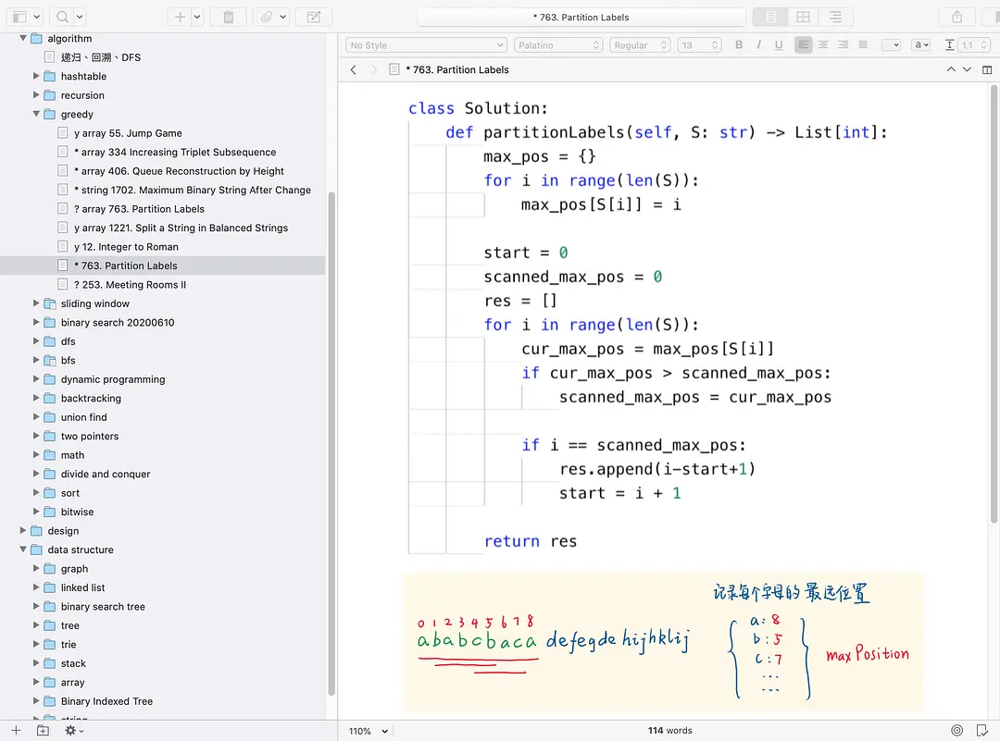
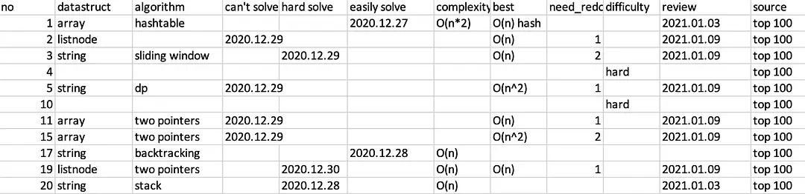

# 爱尔兰文科硕士转码申请留学找工面试经验 | 6.3 更新

来自: [Jarry(。)](https://www.douban.com/people/jrjw/?_i=7364553FQMtshO) 2021-01-24 06:08:57

#### 6.3 更新

刚知道同专业关系比较好的女生也拿到offer了, 激动更新...

我跟这个女生认识是刚开学的时候, 因为我们有很多作业是写论文, 我想找个学习partner, 然后她在网课上比较活跃, 后来了解也是想留爱找工作的. 后面我们基本上每个作业都会自己分析下思路, 写完初稿后互相给意见. (我俩目前的成绩都是1:1)

然后在课程之余, 也就是第一学期结束, 我们专业是信息系统, 所以就业方向最对口的是business analyst 她想找business analyst或者data analyst的工作, 我想找sde的工作, 但基础的python或者是入门项目是可以一起做的... 比如说forage上的虚拟实习. 也会互相推荐网课, 还有看cv

后来我二月拿到offer 但也会经常联系(我——催人学习找工的朋友😂) 然后五月第二学期结束她又开始密集投简历, 今天下午告诉我拿到offer了. 为她感到开心

总结:

1\. 在同专业找个目标一致的学习伙伴真的不错, 可以互相帮助互相督促给建议. 即使是同方向, 找到工作进度有先后也没什么. 是在整个就业市场竞争, 不是跟你身边的人竞争. “除开极端情况，尽可能采取合作的态度，与他人有利益冲突时尽量通过谈判寻求两全其美的办法。” 合作可以共赢

2\. 我发帖子后很多人说爱尔兰就业市场很差... 很多人没找到工作. 但从我经历的和观察到的, 只要你提早准备, 是技术岗方向的, 简历上有项目, 简历过关, 有一些能力, 找工还是不难的...

但如果你只是跟学校课程走, 没有方向, 简历上内容很少, 简历写的很差... 那找不到工作是大概率的. 比如前段时间办理另一个noneu的女生说自己从去年开始投简历, 一个面试也没有... 我后来看到她简历真的问题很大...

3\. 从我这半个月听到的消息, 很多人都有不少面试机会, 爱尔兰就业市场可能在恢复吧

#### 爱尔兰相关帖子指路

- 转码之爱尔兰转留学欧洲求职分享 [https://www.1point3acres.com/bbs/thread-756008-1-1.html](https://www.douban.com/link2/?url=https%3A%2F%2Fwww.1point3acres.com%2Fbbs%2Fthread-756008-1-1.html&link2key=96016e2241)
- 2020爱尔兰留学找工作干货知识点和咨询问题总结（来自4月写的知乎专栏）[https://www.1point3acres.com/bbs/thread-645828-1-1.html](https://www.douban.com/link2/?url=https%3A%2F%2Fwww.1point3acres.com%2Fbbs%2Fthread-645828-1-1.html&link2key=96016e2241)
- 转专业女生的爱尔兰IT就业找工作经历（超详细的入职回顾）[https://www.1point3acres.com/bbs/thread-645839-1-1.html](https://www.douban.com/link2/?url=https%3A%2F%2Fwww.1point3acres.com%2Fbbs%2Fthread-645839-1-1.html&link2key=96016e2241)
- 李水水专栏 https://www.zhihu.com/people/li-shui-shui-75/posts

### Roadmap

一、转码过程

二、爱尔兰转码难度和就业

三、找工面试经验

四、常见爱尔兰留学问题

#### 一、转码过程

我是2016年德语国内本科毕业, 毕业之后没有正常工作... 2019年6月份决定出国, 当时查了一圈资料以及有个程序员朋友也在爱尔兰, 收集了信息, 觉得不错比较适合自己. 就定了

关于爱尔兰留学基本信息的文章请大家看知乎上李水水的文章 https://www.zhihu.com/people/li-shui-shui-75/posts 基础问题都讲到了

组里也有讨论的帖子 https://www.douban.com/group/topic/208518025/

1\. 申请

我花了500rmb找了个中介咨询, 全程diy, 花钱主要是为了咨询学校和专业, 个人还挺满意的... 当然自己收集信息也可以 他们家也有给写ps的套餐好像是2500rmb... 有兴趣的话可以私信我(的确是便宜实惠服务也很好...拿到offer后咨询回复态度都很好 没有回扣的😂

九月份准备了一个月, 十月份考的雅思, 成绩出来之后写ps, 也没花太多时间, 十一月投的两个学校三个专业, 分别是ucc的information system for business performance 和 一个管理信息系统和会计, 还有个是nuig(高威)的转专业软件工程. 其实对于转码最匹配的是ucd的cs conversion, 但是都柏林学费太贵了...生活费太贵了, 我是自己出钱, 就没考虑.

三个专业的offer都拿到了, 有些是十一月出的, 有些是十二月, 最后选了ucc的isbp, 原因

1\. nuig的课程很硬, 但转专业要读两年, 学费生活费开销也不便宜, isbp比起另一个专业更技术向一点(读了之后发现也很水...)

2\. Isbp的学费是18000欧, 我拿到3600欧的奖学金, 实际只要付14400欧. 比去ucd cs conversion的20k+的学费便宜了不少

3\. 考虑爱尔兰也就那么些学校, 招聘真的没那么卡学校, 排名更低的dit只要项目经验够,都能拿到大厂面试机会.

4\. 我不准备回国, qs排名对我没意义...

选校和专业总结

a. 选校: 如果为了转码, 转码上岸的标准是找到工作, 而不是学校排名, 也不是课程 (大厂转码要求全部可以自学, 我甚至觉得课程太硬不适合找工) 拿爱尔兰来说, 很多人看不上的dit, cit都可以过大厂的简历关. 有名校情结当我没说...

b. 专业: 如果不是为了回国, 经济又比较紧张, 可以选择费用低的项目(我就读的ucc isbp 18k, 有奖学金, 扣除后14k, ucd cs conversion 25k), 用起来都一样的...

2\. 奖学金

2020年2月的时候朋友告诉我爱尔兰教育部有个给国际生的奖学金, 一年制的master也可以... 看了下发现是全奖+1w欧的生活费, 一年60个名额. 还等麻烦的... 但当时觉得不申白不申, 中了就赚了... 就申了

https://eurireland.ie/2020/02/10/government-of-ireland-international-education-scholarships-2020/

有心的友邻可以申请看看, 不申白不申, 中了就赚了...

3\. 学习找工

如果建立没有相关经验, 在课程之外一定要多做项目, 好丰富简历, 多加一些项目经验(因为实习经验更难), 所以网上找了很多关于网课或者是在线网站能有项目经验的, 我的选择是:

1\. 花了接近60h做了个huawei European challenge 根本没拿奖 但写在简历里了

2, 有个网站叫forage https://www.theforage.com/上面有很多虚拟实习, 就是公司事先设计好的项目, 做了可以写在简历上

大家也可以参考这个帖子 \[简历上加项目：有没有好的MOOC慕课网课推荐\] https://www.1point3acres.com/bbs/thread-522357-1-1.html

工作找了个学姐内推, 之后就oa, vo走流程, 复习面试的经验很多帖子都提到, 就不废话了

#### 二、爱尔兰转码难度和就业

1\. 转专业: 我觉得难度真的很低... 我本科是德语的, 还知道有法律的录了ucd的cs conversion 我当时选爱尔兰没选荷兰也是荷兰卡专业卡的比较严... 有钱读得起ucd的cs conversion绝对是根正苗红的cs出身了... 我选的信息系统其实算偏门的

2\. 找工作: 从李水水的经验来说... 我觉得起码比北美和国内容易多了 但我的背景如果在国内或者北美 指不定连oa也拿不到... 但ucd是爱尔兰最好的cs学校了... 你这个学校出来找到工作的概率应该远大于在北美读个不大可能是top的学校吧... 我个人建议的策略是主攻大厂grad sde 我和李水水都是靠这上岸的

3\. 本人目前在cork, cork我知道有的tech大厂是apple, dell, vmware... 和我们学校都有合作项目 (大概注意看专业的内容简介)

4\. 工资: 都柏林大厂码农公司不低 grad base 45k-70k 还有bonus和stock, 也不加班, 年假25天！不比��他国家差, 想玩可以出去旅游😂

5\. 北美目前了解的已经很卷了... 拿我本科学弟举例, 欧洲交换, 研究生加拿大不错的某校, 有coop, 三实习, 加拿大很努力找了半年没找到全职... 欢迎来爱尔兰, 爱尔兰真的不卷😂

#### 三、找工面试经验

其实我找工没啥经验... 我是海投n内推1然后那个内推的公司走到底...

但准备面试的可以说一下自己的经验, 不过只限于大厂流程化的过程吧

1\. 刷题

我数据结构和算法入门课是这门网课 [数据结构](https://mooc.study.163.com/course/1000033001?tid=2403023004&_trace_c_p_k2_=75b55f9969dd48c9b7543add34daa364#/info)

不过时间比较紧的同学, 可以直接刷, 我总的刷了两三百题, 也不算很多, 但高频和常见的考点都覆盖到.

a. 按专题刷, 参见这个网站[算法模版](https://greyireland.gitbook.io/algorithm-pattern/)

b. 按高频top100刷, 快速刷, 做不来看国内leetcode的题解区, 用户liweiwei的题解特别强... 如果某个知识点不熟练, 有些题解里会总结相似题型的一堆题, 建议一起做

c. 记笔记复习

截图是我的笔记, 左侧可以看到我是根据algorithm, design, data structure分成三类, 下面还有小类, 每个题前面标 * 表示重点关注 ? 可以做出来但不熟练 y 过了, 右边截图代码和笔记, 尽量做最优解, 因为面试的时候面试官基本都不是想要你给个brute-force

面试前突击刷的时候(每天10-20题) 还会做个excel, 记录每道题的考点, 最优解法, 要不要复习, 初刷一遍肯定要复习的...

2\. behavior question

a. 弄清楚要问什么, 建议看youtube上这个频道 [Dan Croitor](https://www.youtube.com/channel/UCw0uQHve23oMWgQcTTpgQsQ)

总结来说, 对初级sde至少准备三类故事, 第一类是成功故事: 注意用数据, 结合所投岗位的jd, 不要说太夸张. 第二类是失败故事, 但失败故事的终点是你学到了什么, 不要指责队友. 重点是学到了什么以及反思. 第三类是团队合作, 重点突出沟通能力, 时间管理

b. 准备

我大概准备了六个故事, 每个按照Situation, Task, Action, Result都写了下来(一天写一两个吧, 一星期也能准备挺多)

3\. 模拟面试 practice makes perfect

a. 推荐pramp这个网站, 我主要做algorithms, 面试前几天做了几次behavioral, 自己埋头准备其实很难发现自己的缺点, 我建议现场互相给feedback

最后我总结的是技术面这几点:

1\. 先问清题目要求什么, 比如输入是什么范围啊, 有没有顺序啊, 格式啊

2\. 再搞清楚逻辑, 写pseudo code, 这个过程一定要说出来, 跟面试官沟通

3\. 实现

4\. 主动检查, 主动跑一个test, 考虑edge case

5\. 算复杂度

6\. 考虑优化, 或者说自己有意识到优化的空间, 但时间不够了

推荐这两个演示视频 [Amazon Leadership Principles (SIP)](https://www.youtube.com/watch?v=CpcxVE5JIX4) 、[Amazon Coding Sample (SIP)](https://www.youtube.com/watch?v=mjZpZ_wcYFg)

bq我个人要提醒自己的是: situation和task可以简单讲讲, 具体讲action和result (这是我mock中知道的... 我有个毛病跟人解释东西怕对方不清楚, 前因可以讲五分钟...) 每个人都不一样, 多mock, 问问反馈

b. 找熟人面试

pramp上基本都是跟自己一样的求职者, 而且一般都是比较初级的, 我还找了两个senior developer的朋友帮我mock, 第一个朋友是大厂, 流程差不多, 除了bq的重点稍稍有些不同. 第二个朋友是小厂, bq基本不问, 主要问语言特性... 据说我的回答减分挺多的.

4\. 总结

1\. 去招聘网站上找搜索感兴趣的岗位, 把job description整理下来, 特别关注basic requirements

2\. 和自己的技能进行对比, 哪些不会的, 搜网课或者其他, 基础知识先学会, 加到简历里

3\. 网上找相关经验的项目做, 加到简历里

4\. 开始投简历, 在面试中学习

面试的时候被问了个问题: 如何学习新知识... 我个人目前的习惯是, 想干什么 先谷歌查下tutorial 关于这个知识的入门材料 多开几个标签页, 选一两个觉得靠谱的(这里面决策靠感觉) 入门了之后看实际问题要解决的是什么 最后要实现怎么样的东西

比如面试的两大部分就是bq和code, bq这块变小就是答题模版, 常见问题, 自己的案例 和模拟面试, code就是数据结构算法, 模拟面试... 两头都知道了再把中间任务慢慢安排上

组里有些同学问的问题, 每个人的情况不大一样, 其实很难给一个准确的回答. 特别是关于学什么语言啊, python怎么学啊, 面试怎么准备啊

先尝试搜索 xx tutorial (python tutorial, xx interview tutorial 之类的, 英文网站的文章搜索推荐还挺好的) 如果实在在公开引擎上找不到资料, 再看看尝试找有经验的人问具体的问题. 我中间找了三个朋友帮忙, 每次联系都会提供自己的cv, 想问的问题, 找人mock的时候提供cv、投的岗位的jd、该公司大致的面试流程和问题example, 这样节约别人的时间, 也能得到更有价值的信息.

欢迎大家来爱尔兰~

#### 四、常见爱尔兰留学问题

1\. 转码适合的学校和项目:

ucd cs conversion(一年半), ucc isbp(信息系统, 非cs, 我读的专业), Galway software development(两年)

其他的不清楚, 但基本每个学校应该都有, 还有种是两年先读一年higher diploma再申请硕士

2\. GOI-IES 的奖学金本科生能不能申, xx能不能申?

不限专业不限国籍不限学校只要是国际学生都可以, 具体见官网https://eurireland.ie/2020/02/10/government-of-ireland-international-education-scholarships-2020/

3\. 爱尔兰学校对本科学校和成绩有没有什么要求?

热门学校热门专业或多或少有, ucd 985 70分 211 75分, 但爱尔兰竞争比大多数热门留学国家要求都低. 不用着迷tcd、ucd

身边有二本还有绩点低各种申请上的, 根据自己情况找找定位, 整整cv和ps好好写

4\. 爱尔兰留学生相关的移民政策 [visa分类页面](http://www.inis.gov.ie/en/inis/pages/registration-stamps)

a. 硕士毕业可能拿两年stamp 1G 就是没有工作也可以待在爱尔兰

b. 入职拿stamp1, 如果年收入30k+以及是[critical skills](https://enterprise.gov.ie/en/What-We-Do/Workplace-and-Skills/Employment-Permits/Employment-Permit-Eligibility/Highly-Skilled-Eligible-Occupations-List/)列表上(大多数it岗位都是) 两年后就可以转stamp4(相当于绿卡)

c. 移民好像是要5年... 没具体研究

5\. 大致费用:

学费15k-23k欧元, 生活费cork 800欧/月, 都柏林1200欧/月 (正常标准, 不过度节俭, 也不奢侈), 总费用在20w-30w rmb左右

6\. 入门选什么语言

建议python, 原因简单, 建议英文学, 搜python tutorial

这个帖子下面的讨论还挺好的 https://www.douban.com/group/topic/198471155/

我只写python, 会看java和c++基础的语法, 正在学go

已赞 353

已收藏 3351

[转发 121](https://www.douban.com/share/recommend?sanity_key=_96fb9&apikey=&object_kind=1013&name=%E7%88%B1%E5%B0%94%E5%85%B0%E6%96%87%E7%A7%91%E7%A1%95%E5%A3%AB%E8%BD%AC%E7%A0%81%E7%94%B3%E8%AF%B7%E7%95%99%E5%AD%A6%E6%89%BE%E5%B7%A5%E9%9D%A2%E8%AF%95%E7%BB%8F%E9%AA%8C+%7C+6.3+%E6%9B%B4%E6%96%B0&image=https%3A%2F%2Fimg9.doubanio.com%2Fview%2Fgroup_topic%2Fl%2Fpublic%2Fp404580941.jpg&target_action=0&redir=https%3A%2F%2Fwww.douban.com%2Fgroup%2Ftopic%2F209301517%2F&object_id=209301517&heading=%E8%BD%AC%E5%8F%91%E5%88%B0%E8%B1%86%E7%93%A3&target_type=rec&btn_text=%E8%BD%AC%E5%8F%91&href=https%3A%2F%2Fwww.douban.com%2Fgroup%2Ftopic%2F209301517%2F&action_props=%7B%22note_url%22%3A%22https%3A%5C%2F%5C%2Fwww.douban.com%5C%2Fgroup%5C%2Ftopic%5C%2F209301517%5C%2F%22%2C%22note_title%22%3A%22%E7%88%B1%E5%B0%94%E5%85%B0%E6%96%87%E7%A7%91%E7%A1%95%E5%A3%AB%E8%BD%AC%E7%A0%81%E7%94%B3%E8%AF%B7%E7%95%99%E5%AD%A6%E6%89%BE%E5%B7%A5%E9%9D%A2%E8%AF%95%E7%BB%8F%E9%AA%8C+%7C+6.3+%E6%9B%B4%E6%96%B0%22%2C%22author_name%22%3A%22Jarry%22%7D&curl=&type=com.douban.people&properties=%7B%22href%22%3A%22https%3A%5C%2F%5C%2Fwww.douban.com%5C%2Fpeople%5C%2Fjrjw%5C%2F%22%2C%22name%22%3A%22Jarry%22%2C%22uid%22%3A%22223133063%22%7D&desc=6.3+%E6%9B%B4%E6%96%B0%0D%0A%E5%88%9A%E7%9F%A5%E9%81%93%E5%90%8C%E4%B8%93%E4%B8%9A%E5%85%B3%E7%B3%BB%E6%AF%94%E8%BE%83%E5%A5%BD%E7%9A%84%E5%A5%B3%E7%94%9F%E4%B9%9F%E6%8B%BF%E5%88%B0offer%E4%BA%86%2C+%E6%BF%80%E5%8A%A8%E6%9B%B4%E6%96%B0...%0D%0A%E6%88%91%E8%B7%9F%E8%BF%99%E4%B8%AA%E5%A5%B3%E7%94%9F%E8%AE%A4%E8%AF%86%E6%98%AF%E5%88%9A%E5%BC%80%E5%AD%A6%E7%9A%84%E6%97%B6%E5%80%99%2C+%E5%9B%A0%E4%B8%BA%E6%88%91%E4%BB%AC%E6%9C%89%E5%BE%88%E5%A4%9A%E4%BD%9C%E4%B8%9A%E6%98%AF%E5%86%99%E8%AE%BA%E6%96%87%2C+%E6%88%91%E6%83%B3%E6%89%BE%E4%B8%AA%E5%AD%A6%E4%B9%A0partner%2C+%E7%84%B6%E5%90%8E%E5%A5%B9%E5%9C%A8%E7%BD%91%E8%AF%BE%E4%B8%8A%E6%AF%94%E8%BE%83%E6%B4%BB%E8%B7%83%2C+%E5%90%8E%E6%9D%A5%E4%BA%86...)

[回应](https://www.douban.com/group/topic/209301517/#sep) [转发](https://www.douban.com/group/topic/209301517/?type=rec#sep) [赞](https://www.douban.com/group/topic/209301517/?type=like#sep) [收藏](https://www.douban.com/group/topic/209301517/?type=collect#sep) [只看楼主](https://www.douban.com/group/topic/209301517/?author=1#sep)

### 最赞回应

- 
    
    #### [Jarry](https://www.douban.com/people/jrjw/) (。) 楼主 2021-02-26 03:22:55
    
    
    
    有些同学可能觉得我找工太容易了... 低估了爱尔兰找工的难度(但客观来讲, 比起北美还是容易的) 我的长处是学习能力很高...(说这样的话比较羞耻) 比较容易弄清楚事物之间的联系, 找到正确的路径 本科虽然是学德语和金融的, gpa是3.8+/4.0, 雅思7.5 leetcode在国内就开始刷了... 从去年四月份到八月份都在刷, 然后再是今年年初的几个月 还有个美区的号, 所以整体刷了三四百题, 大多是medium我都是会做的, 知识点学到union find, 字典树这种比较偏的了... 好消息是, 我的室友和同班的一个姐妹也是今年初完成的做项目、改简历、申请, 陆续有收到online assessment和面试邀约的, 如果周围的人有找到工作, 我会更新在留言里 另外说下爱尔兰的国家情况, 虽然是小国家, 但支柱产业是计算机、金融、药厂, 本地劳动力满足不了需求, 所以有很多岗位. 对it从业者的移民政策非常友好
    
    赞 (80) [回应](https://www.douban.com/group/topic/209301517/?cid=2987771490#last)
    
- 
    
    #### [冒热气的小茶壶](https://www.douban.com/people/185017056/) (暗夜中的余香) 2021-03-28 14:40:40
    
    UCC毕业生路过…爱尔兰是很不错的国家，人民非常质朴友好。给大家提供一些参考的建议吧！ 1. 一个班中国人不少，最后能留下来的少于一半。找工作没有那么容易，本国公民找工作都不容易。我身边留下来的朋友也是找了甚至有半年的，竞争力很大，要做好吃苦的打算。只要找到工作基本就可以留下来了。 2. 天气非常差，常年刮风下雨，晴天就是老天的眷顾了。 3. 能去都柏林就尽量去都柏林。 4. 英语能力是硬指标，即使无法达到母语者水平，也要达到流畅的工作交流水平。 各位加油！💪
    
    赞 (74) [回应](https://www.douban.com/group/topic/209301517/?cid=3072425604#last)
    
- 
    
    #### [吃巧克力吧](https://www.douban.com/people/4669837/) 2021-01-24 08:46:47
    
    我是自学的…就挺基础的python pandas numpy那种 不过去年啃了网易公开课上浙大的数据结构 对刷 [...](#) [Jarry](https://www.douban.com/people/jrjw/)
    
    udemy上的the complete 2021web development bootcamp.主要是新手友好，手把手教学🥲
    
    赞 (65) [回应](https://www.douban.com/group/topic/209301517/?cid=2919532572#last)
    
- 
    
    #### [莫呼洛迦](https://www.douban.com/people/41586664/) 2021-01-25 02:10:24
    
    我身边念cs的都留下来且找到了工作，去大厂是比较难，一开始小公司不愿意办工签就用毕业签上班，经验积攒够了，可以一边上班一边面试，有经验更好换给工签的工作。（但是毕业签的两年不算在绿卡里面，有得有失。）
    
    赞 (41) [回应](https://www.douban.com/group/topic/209301517/?cid=2921294672#last)
    
- 
    
    #### [莫呼洛迦](https://www.douban.com/people/41586664/) 2021-02-16 18:34:49
    
    我知道ucd好几个三本成功申请的（没有歧视的意思）自己多对比研究一下吧
    
    赞 (32) [回应](https://www.douban.com/group/topic/209301517/?cid=2965255930#last)
    

- 
    
    #### [吃巧克力吧](https://www.douban.com/people/4669837/) 2021-01-24 08:32:42
    
    请问您觉得forage那个项目难度大吗，我在欧陆读书学习压力还挺大，担心做不完半途而废。
    
    赞 (1) [回应](https://www.douban.com/group/topic/209301517/?cid=2919523562#last)
    
- 
    
    #### [Jarry](https://www.douban.com/people/jrjw/) (。) 楼主 2021-01-24 08:34:06
    
    请问您觉得forage那个项目难度大吗，我在欧陆读书学习压力还挺大，担心做不完半途而废。 [吃巧克力吧](https://www.douban.com/people/4669837/)
    
    那个项目毫无压力……做成什么样都给证书😂😂😂 （我还是认真做的… youtube上也有知道 kpmg那个入门下数据分析还挺好的 jpmorgan那个就太水了…
    
    赞 (8) [回应](https://www.douban.com/group/topic/209301517/?cid=2919524375#last)
    
- 
    
    #### [吃巧克力吧](https://www.douban.com/people/4669837/) 2021-01-24 08:36:36
    
    那个项目毫无压力……做成什么样都给证书😂😂😂 （我还是认真做的… youtube上也有知道 kp [...](#) [Jarry](https://www.douban.com/people/jrjw/)
    
    哈哈哈哈哈哈哈，那就好，看起来您在去爱尔兰上学前已经学习了一段时间的编程，我最近刚刚完成建自己的博客和上完组里说的转码神课，不知道下一步该怎么办…
    
    赞 (4) [回应](https://www.douban.com/group/topic/209301517/?cid=2919525910#last)
    
- 
    
    #### [吃巧克力吧](https://www.douban.com/people/4669837/) 2021-01-24 08:37:02
    
    PS：感觉您一定能找到工作的！
    
    赞 (2) [回应](https://www.douban.com/group/topic/209301517/?cid=2919526149#last)
    
- 
    
    #### [Jarry](https://www.douban.com/people/jrjw/) (。) 楼主 2021-01-24 08:43:08
    
    哈哈哈哈哈哈哈，那就好，看起来您在去爱尔兰上学前已经学习了一段时间的编程，我最近刚刚完成建 [...](#) [吃巧克力吧](https://www.douban.com/people/4669837/)
    
    我是自学的…就挺基础的python pandas numpy那种 不过去年啃了网易公开课上浙大的数据结构 对刷题帮助很大… 觉得自己对于网络啊 操作系统都很欠缺… 我是发现自己对前端实在没兴趣 所以大家比较推荐的前端项目都没搞… 求问组里的转码神课是什么😂
    
    赞 (10) [回应](https://www.douban.com/group/topic/209301517/?cid=2919530025#last)
    
- 
    
    #### [吃巧克力吧](https://www.douban.com/people/4669837/) 2021-01-24 08:46:47
    
    我是自学的…就挺基础的python pandas numpy那种 不过去年啃了网易公开课上浙大的数据结构 对刷 [...](#) [Jarry](https://www.douban.com/people/jrjw/)
    
    udemy上的the complete 2021web development bootcamp.主要是新手友好，手把手教学🥲
    
    赞 (65) [回应](https://www.douban.com/group/topic/209301517/?cid=2919532572#last)
    
- 
    
    #### [吃巧克力吧](https://www.douban.com/people/4669837/) 2021-01-24 08:47:11
    
    我是自学的…就挺基础的python pandas numpy那种 不过去年啃了网易公开课上浙大的数据结构 对刷 [...](#) [Jarry](https://www.douban.com/people/jrjw/)
    
    大家推荐的前端项目是啥🥲
    
    赞 (1) [回应](https://www.douban.com/group/topic/209301517/?cid=2919532845#last)
    
- 
    
    #### [Jarry](https://www.douban.com/people/jrjw/) (。) 楼主 2021-01-24 08:49:09
    
    大家推荐的前端项目是啥🥲 [吃巧克力吧](https://www.douban.com/people/4669837/)
    
    我这里是说我之前找项目看到的…… 我明天看看能不能找到原贴
    
    赞 (1) [回应](https://www.douban.com/group/topic/209301517/?cid=2919534161#last)
    
- 
    
    #### [吃巧克力吧](https://www.douban.com/people/4669837/) 2021-01-24 08:50:45
    
    我这里是说我之前找项目看到的…… 我明天看看能不能找到原贴 [Jarry](https://www.douban.com/people/jrjw/)
    
    谢谢您！！！！
    
    赞 (1) [回应](https://www.douban.com/group/topic/209301517/?cid=2919535318#last)
    
- 
    
    #### [小林绿子](https://www.douban.com/people/179717249/) 2021-01-24 14:57:32
    
    谢谢楼主的经验分享～夸夸！
    
    赞 [回应](https://www.douban.com/group/topic/209301517/?cid=2920082597#last)
    
- 
    
    #### [Jarry](https://www.douban.com/people/jrjw/) (。) 楼主 2021-01-24 17:16:20
    
    谢谢您！！！！ [吃巧克力吧](https://www.douban.com/people/4669837/)
    
    https://www.1point3acres.com/bbs/thread-522357-1-1.html 这个帖子
    
    赞 (3) [回应](https://www.douban.com/group/topic/209301517/?cid=2920314428#last)
    
- 
    
    #### [丧丧宇](https://www.douban.com/people/177689241/) 2021-01-24 17:20:31
    
    姐妹我好奇的问一下没有任何会计方面的经验也可以申请爱尔兰的会计专业吗？
    
    赞 (1) [回应](https://www.douban.com/group/topic/209301517/?cid=2920322548#last)
    
- 
    
    #### [Jarry](https://www.douban.com/people/jrjw/) (。) 楼主 2021-01-24 17:22:13
    
    姐妹我好奇的问一下没有任何会计方面的经验也可以申请爱尔兰的会计专业吗？ [丧丧宇](https://www.douban.com/people/177689241/)
    
    有转专业的会计 ucc这个mimas就是没有前置要求 https://www.ucc.ie/en/ckl05/ 你也可以找找还有没有其他项目
    
    赞 (2) [回应](https://www.douban.com/group/topic/209301517/?cid=2920325694#last)
    
- 
    
    #### [丧丧宇](https://www.douban.com/people/177689241/) 2021-01-24 17:24:26
    
    有转专业的会计 ucc这个mimas就是没有前置要求 https://www.ucc.ie/en/ckl05/ 你也可以找找还有 [...](#) [Jarry](https://www.douban.com/people/jrjw/)
    
    感谢🙏
    
    赞 (1) [回应](https://www.douban.com/group/topic/209301517/?cid=2920329689#last)
    
- 
    
    #### [吃巧克力吧](https://www.douban.com/people/4669837/) 2021-01-24 18:35:48
    
    https://www.1point3acres.com/bbs/thread-522357-1-1.html 这个帖子 [Jarry](https://www.douban.com/people/jrjw/)
    
    谢谢谢谢谢谢
    
    赞 (1) [回应](https://www.douban.com/group/topic/209301517/?cid=2920460244#last)
    
- 
    
    #### [Swagkkk](https://www.douban.com/people/216974084/) 2021-01-24 18:41:36
    
    我在贴吧里看到有一个人说ucd cs每年毕业生能找到工作并留下来的个位数，不知道是不是真的，或者如果爱尔兰找不到工作有可能在欧洲其他国家找到吗
    
    赞 (2) [回应](https://www.douban.com/group/topic/209301517/?cid=2920471091#last)
    
- 
    
    #### [Jarry](https://www.douban.com/people/jrjw/) (。) 楼主 2021-01-24 19:28:35
    
    我在贴吧里看到有一个人说ucd cs每年毕业生能找到工作并留下来的个位数，不知道是不是真的，或者 [...](#) [Swagkkk](https://www.douban.com/people/216974084/)
    
    1\. 不知道这个信息的可信度 2. 不确定有多少人想留下找工作 所以如果是个位数占想留下找工作的努力多少 3. 我问学姐她说认真找的可能有些大厂一些小厂 但都留下了…
    
    赞 (11) [回应](https://www.douban.com/group/topic/209301517/?cid=2920559925#last)
    
- 
    
    #### [Jarry](https://www.douban.com/people/jrjw/) (。) 楼主 2021-01-24 19:29:08
    
    我在贴吧里看到有一个人说ucd cs每年毕业生能找到工作并留下来的个位数，不知道是不是真的，或者 [...](#) [Swagkkk](https://www.douban.com/people/216974084/)
    
    爱尔兰毕业欧洲国家就业的政策我没了解不好意思
    
    赞 (1) [回应](https://www.douban.com/group/topic/209301517/?cid=2920560993#last)
    
- 
    
    #### [Jarry](https://www.douban.com/people/jrjw/) (。) 楼主 2021-01-24 19:36:22
    
    我在贴吧里看到有一个人说ucd cs每年毕业生能找到工作并留下来的个位数，不知道是不是真的，或者 [...](#) [Swagkkk](https://www.douban.com/people/216974084/)
    
    我来爱尔兰还有个原因是爱尔兰critical skills 两年工签就能转类似永居的stamp4… 所以基本不会考虑去欧洲其他国家
    
    赞 (8) [回应](https://www.douban.com/group/topic/209301517/?cid=2920575052#last)
    
- 
    
    #### [Swagkkk](https://www.douban.com/people/216974084/) 2021-01-25 00:42:06
    
    1\. 不知道这个信息的可信度 2. 不确定有多少人想留下找工作 所以如果是个位数占想留下找工作的努 [...](#) [Jarry](https://www.douban.com/people/jrjw/)
    
    嗯嗯好的谢谢解答了，因为我也在犹豫要不要申爱尔兰的学校，只是实在不想回国，所以看看前辈们的经验贴，希望你能拿到满意的offer啊！
    
    赞 (1) [回应](https://www.douban.com/group/topic/209301517/?cid=2921209155#last)
    
- 
    
    #### [麻吉可爱多](https://www.douban.com/people/maggiesun0304/) (-) 2021-01-25 01:34:57
    
    哇谢谢楼主分享！看了楼主楼上的回复，感觉爱尔兰找工+拿身份的难度不高？我是现在在国内996大厂工作攒钱中，请问楼主目前开销花了多少哇，需要准备多少钱比较合适（如果觉得太私人也可以不回答hhh
    
    赞 (2) [回应](https://www.douban.com/group/topic/209301517/?cid=2921269106#last)
    
- 
    
    #### [Jarry](https://www.douban.com/people/jrjw/) (。) 楼主 2021-01-25 01:43:02
    
    哇谢谢楼主分享！看了楼主楼上的回复，感觉爱尔兰找工+拿身份的难度不高？我是现在在国内996大厂 [...](#) [麻吉可爱多](https://www.douban.com/people/maggiesun0304/)
    
    學費什麼的你查官網的 大概在15k-20k eur 浮動 雅思1krmb 机票6krmb 近4个月平均每个月8krmb其中房租一个月3krmb（我在cork都柏林可能要6krmb
    
    赞 (4) [回应](https://www.douban.com/group/topic/209301517/?cid=2921275799#last)
    
- 
    
    #### [Jarry](https://www.douban.com/people/jrjw/) (。) 楼主 2021-01-25 01:44:29
    
    哇谢谢楼主分享！看了楼主楼上的回复，感觉爱尔兰找工+拿身份的难度不高？我是现在在国内996大厂 [...](#) [麻吉可爱多](https://www.douban.com/people/maggiesun0304/)
    
    我觉得找工+身份的难度都算很容易的了…… critical skills的你查下爱尔兰stamp4 爱尔兰硕士毕业是给两年1g签证
    
    赞 (2) [回应](https://www.douban.com/group/topic/209301517/?cid=2921276923#last)
    
- 
    
    #### [Jarry](https://www.douban.com/people/jrjw/) (。) 楼主 2021-01-25 01:45:08
    
    嗯嗯好的谢谢解答了，因为我也在犹豫要不要申爱尔兰的学校，只是实在不想回国，所以看看前辈们的 [...](#) [Swagkkk](https://www.douban.com/people/216974084/)
    
    好的谢谢！我给你爱尔兰是我研究目前靠读书和工作最容易留的了！
    
    赞 (6) [回应](https://www.douban.com/group/topic/209301517/?cid=2921277436#last)
    
- 
    
    #### [莫呼洛迦](https://www.douban.com/people/41586664/) 2021-01-25 02:10:24
    
    我身边念cs的都留下来且找到了工作，去大厂是比较难，一开始小公司不愿意办工签就用毕业签上班，经验积攒够了，可以一边上班一边面试，有经验更好换给工签的工作。（但是毕业签的两年不算在绿卡里面，有得有失。）
    
    赞 (41) [回应](https://www.douban.com/group/topic/209301517/?cid=2921294672#last)
    
- 
    
    #### [Jarry](https://www.douban.com/people/jrjw/) (。) 楼主 2021-01-25 07:40:14
    
    我身边念cs的都留下来且找到了工作，去大厂是比较难，一开始小公司不愿意办工签就用毕业签上班， [...](#) [莫呼洛迦](https://www.douban.com/people/41586664/)
    
    我听到的情况也是这样... 爱尔兰的移民政策还是比较友好的话 进大厂就是一步到位!
    
    赞 (1) [回应](https://www.douban.com/group/topic/209301517/?cid=2921369711#last)
    
- 
    
    #### [古灵精怪梅薇思](https://www.douban.com/people/197868060/) (melody affection) 2021-01-25 10:41:22
    
    卧槽姐妹你太牛了！
    
    赞 (5) [回应](https://www.douban.com/group/topic/209301517/?cid=2921546775#last)
    
- 
    
    #### [古灵精怪梅薇思](https://www.douban.com/people/197868060/) (melody affection) 2021-01-25 10:42:08
    
    集美我是想问一下，就是information management这种专业算是转码嘛？
    
    赞 (1) [回应](https://www.douban.com/group/topic/209301517/?cid=2921547918#last)
    
- 
    
    #### [。](https://www.douban.com/people/174802409/) 2021-01-25 13:29:42
    
    好贴
    
    赞 (1) [回应](https://www.douban.com/group/topic/209301517/?cid=2921823881#last)
    
- 
    
    #### [莫呼洛迦](https://www.douban.com/people/41586664/) 2021-01-25 15:03:23
    
    我听到的情况也是这样... 爱尔兰的移民政策还是比较友好的话 进大厂就是一步到位! [Jarry](https://www.douban.com/people/jrjw/)
    
    是呀，能不能进大厂也和个人能力有关系。
    
    赞 (1) [回应](https://www.douban.com/group/topic/209301517/?cid=2921980128#last)
    
- 
    
    #### [一敏](https://www.douban.com/people/221918306/) 2021-01-25 15:08:51
    
    有没有python或者Java入门课推荐
    
    赞 (1) [回应](https://www.douban.com/group/topic/209301517/?cid=2921989522#last)
    
- 
    
    #### [Jarry](https://www.douban.com/people/jrjw/) (。) 楼主 2021-01-25 15:30:35
    
    有没有python或者Java入门课推荐 [一敏](https://www.douban.com/people/221918306/)
    
    我没研究过这个…… 也不确定你要的入门是哪个程度哪个方向的入门 建议知乎搜索python入门 or 谷歌搜索 “python tutorial” or “python basic” 会有很多信息 你挑个自己喜欢的 文章或者交互网课形式的
    
    赞 (5) [回应](https://www.douban.com/group/topic/209301517/?cid=2922026711#last)
    
- 
    
    #### [Jarry](https://www.douban.com/people/jrjw/) (。) 楼主 2021-01-25 15:35:18
    
    嗯嗯好的谢谢解答了，因为我也在犹豫要不要申爱尔兰的学校，只是实在不想回国，所以看看前辈们的 [...](#) [Swagkkk](https://www.douban.com/people/216974084/)
    
    参考下楼下另一个友邻说的 她也说认识的cs都找到工作了
    
    赞 (1) [回应](https://www.douban.com/group/topic/209301517/?cid=2922034700#last)
    
- 
    
    #### [Jarry](https://www.douban.com/people/jrjw/) (。) 楼主 2021-01-25 15:39:07
    
    集美我是想问一下，就是information management这种专业算是转码嘛？ [古灵精怪梅薇思](https://www.douban.com/people/197868060/)
    
    我觉得找到工作算成功转码 所以我目前还不算吧哈哈哈 is属于交叉学科 我看组里也有另一个姐妹转is找到的码农工作 https://www.douban.com/group/topic/206513122/ 也有很多ee找到码农工作的 就起码不会拉胯吧 算招聘里”other related fields” 主要看简历的项目经验和实习经验
    
    赞 (4) [回应](https://www.douban.com/group/topic/209301517/?cid=2922041150#last)
    
- 
    
    #### [古灵精怪梅薇思](https://www.douban.com/people/197868060/) (melody affection) 2021-01-25 21:03:52
    
    我觉得找到工作算成功转码 所以我目前还不算吧哈哈哈 is属于交叉学科 我看组里也有另一个姐妹转i [...](#) [Jarry](https://www.douban.com/people/jrjw/)
    
    感谢集美，也就是算计算机类了！
    
    赞 (3) [回应](https://www.douban.com/group/topic/209301517/?cid=2922635611#last)
    
- 
    
    #### [Jarry](https://www.douban.com/people/jrjw/) (。) 楼主 2021-01-26 20:00:57
    
    感谢集美，也就是算计算机类了！ [古灵精怪梅薇思](https://www.douban.com/people/197868060/)
    
    不同学校不大一样 我们学校其实是在商学院里的 主要看自己怎么整吧
    
    赞 (2) [回应](https://www.douban.com/group/topic/209301517/?cid=2924402241#last)
    
- 
    
    #### [莫呼洛迦](https://www.douban.com/people/41586664/) 2021-01-27 05:29:27
    
    另外，爱尔兰可以自己掏€1000 办CSEP，只要雇主愿意提供相关资料（就是一些证明，合同之类的，没有太多的东西，是一个可以留下来的办法，但是有的公司会觉得我帮了你，你就得尽心尽力的干，如果公司要这样做就赶紧攒经验刷题跳槽）
    
    赞 (10) [回应](https://www.douban.com/group/topic/209301517/?cid=2925120797#last)
    
- 
    
    #### [克莱因的蓝色](https://www.douban.com/people/66359453/) (truer than blue) 2021-01-27 15:35:57
    
    M
    
    赞 (1) [回应](https://www.douban.com/group/topic/209301517/?cid=2925902492#last)
    
- 
    
    #### [莫呼洛迦](https://www.douban.com/people/41586664/) 2021-01-28 18:20:27
    
    「该条回应已被删除」 [Jarry](https://www.douban.com/people/jrjw/)
    
    有码农朋友办过，还没有 Trust partner，就是提交了然后等就行了。
    
    赞 (1) [回应](https://www.douban.com/group/topic/209301517/?cid=2928273133#last)
    
- 
    
    #### [·ω·](https://www.douban.com/people/68740647/) 2021-01-28 22:26:17
    
    楼主好～想问问在爱尔兰，不喝酒可以不影响社交吗？
    
    赞 (1) [回应](https://www.douban.com/group/topic/209301517/?cid=2928747876#last)
    
- 
    
    #### [Jarry](https://www.douban.com/people/jrjw/) (。) 楼主 2021-01-29 20:04:57
    
    楼主好～想问问在爱尔兰，不喝酒可以不影响社交吗？ [·ω·](https://www.douban.com/people/68740647/)
    
    看那种程度的影响? 我室友就不喝酒, 也有local朋友不喝酒的... 如果你交往的人不是看重“会喝酒”的就没关系 如果那堆人在一起目的就是喝酒你不喝那肯定是有影响... 国内也有这种情况吧 看和谁玩了 这里社交最多的其实是walk和coffee哈哈哈哈
    
    赞 (10) [回应](https://www.douban.com/group/topic/209301517/?cid=2930407268#last)
    
- 
    
    #### [·ω·](https://www.douban.com/people/68740647/) 2021-01-30 09:57:42
    
    看那种程度的影响? 我室友就不喝酒, 也有local朋友不喝酒的... 如果你交往的人不是看重“会喝酒 [...](#) [Jarry](https://www.douban.com/people/jrjw/)
    
    谢谢回复↖(^ω^)↗
    
    赞 [回应](https://www.douban.com/group/topic/209301517/?cid=2931286077#last)
    
- 
    
    #### [丧丧宇](https://www.douban.com/people/177689241/) 2021-02-04 23:08:47
    
    马克马克 感谢楼主
    
    赞 (1) [回应](https://www.douban.com/group/topic/209301517/?cid=2942698671#last)
    
- 
    
    #### [来一口饼](https://www.douban.com/people/210790043/) 2021-02-06 17:07:21
    
    请问姐妹本科也可以申请这个奖学金吗！
    
    赞 (3) [回应](https://www.douban.com/group/topic/209301517/?cid=2945892559#last)
    
- 
    
    #### [Jarry](https://www.douban.com/people/jrjw/) (。) 楼主 2021-02-08 05:06:00
    
    请问姐妹本科也可以申请这个奖学金吗！ [来一口饼](https://www.douban.com/people/210790043/)
    
    可以的, 国际学生都可以, 具体你去那个奖学金网站上看一下
    
    赞 (4) [回应](https://www.douban.com/group/topic/209301517/?cid=2948980827#last)
    
- 
    
    #### [Q](https://www.douban.com/people/zhangqingyue/) (Have faith.) 2021-02-13 03:24:42
    
    帮同城友邻来顶一个！
    
    赞 (1) [回应](https://www.douban.com/group/topic/209301517/?cid=2958903293#last)
    
- 
    
    #### [早餐三明治](https://www.douban.com/people/169851513/) 2021-02-15 13:11:27
    
    感谢楼主😂我正好在申请，就加申一下试试
    
    赞 (1) [回应](https://www.douban.com/group/topic/209301517/?cid=2962818150#last)
    
- 
    
    #### [Jarry](https://www.douban.com/people/jrjw/) (。) 楼主 2021-02-15 23:42:05
    
    帮同城友邻来顶一个！ [Q](https://www.douban.com/people/zhangqingyue/)
    
    谢谢友邻 不过我拿到的offer是都柏林的 希望能一直wfh哈哈哈哈
    
    赞 (1) [回应](https://www.douban.com/group/topic/209301517/?cid=2963964489#last)
    
- 
    
    #### [Jarry](https://www.douban.com/people/jrjw/) (。) 楼主 2021-02-15 23:42:25
    
    感谢楼主😂我正好在申请，就加申一下试试 [早餐三明治](https://www.douban.com/people/169851513/)
    
    可以 爱尔兰除了天气不好 （英国也不好） 都挺好的
    
    赞 (1) [回应](https://www.douban.com/group/topic/209301517/?cid=2963965253#last)
    
- 
    
    #### [✿](https://www.douban.com/people/myonlycow/) 2021-02-16 01:17:59
    
    楼主好厉害！
    
    赞 (1) [回应](https://www.douban.com/group/topic/209301517/?cid=2964143168#last)
    
- 
    
    #### [Jarry](https://www.douban.com/people/jrjw/) (。) 楼主 2021-02-16 01:50:08
    
    楼主好厉害！ [✿](https://www.douban.com/people/myonlycow/)
    
    嘻嘻 也有运气成分 努力还是有收获的 爱尔兰不咋卷
    
    赞 (1) [回应](https://www.douban.com/group/topic/209301517/?cid=2964179116#last)
    
- 
    
    #### [Jarry](https://www.douban.com/people/jrjw/) (。) 楼主 2021-02-16 07:16:16
    
    嗯嗯好的谢谢解答了，因为我也在犹豫要不要申爱尔兰的学校，只是实在不想回国，所以看看前辈们的 [...](#) [Swagkkk](https://www.douban.com/people/216974084/)
    
    已经拿到offer的我觉得真的蛮容易留的。。。
    
    赞 (1) [回应](https://www.douban.com/group/topic/209301517/?cid=2964277864#last)
    
- 
    
    #### [Jarry](https://www.douban.com/people/jrjw/) (。) 楼主 2021-02-16 07:18:07
    
    有码农朋友办过，还没有 Trust partner，就是提交了然后等就行了。 [莫呼洛迦](https://www.douban.com/people/41586664/)
    
    谢谢您之前的信息… 我拿到某大厂的offer了 提供visa support 应该不用担心了…
    
    赞 (6) [回应](https://www.douban.com/group/topic/209301517/?cid=2964278345#last)
    
- 
    
    #### [Cici 🥥](https://www.douban.com/people/ciciwit/) 2021-02-16 07:25:48
    
    恭喜上岸！
    
    赞 (1) [回应](https://www.douban.com/group/topic/209301517/?cid=2964280401#last)
    
- 
    
    #### [不搞秀人了](https://www.douban.com/people/214322240/) 2021-02-16 11:58:48
    
    申硕士对国内本科有要求吗
    
    赞 (1) [回应](https://www.douban.com/group/topic/209301517/?cid=2964579875#last)
    
- 
    
    #### [lliiii](https://www.douban.com/people/155602172/) 2021-02-16 12:37:08
    
    楼主 面试都聊什么呀
    
    赞 (1) [回应](https://www.douban.com/group/topic/209301517/?cid=2964640443#last)
    
- 
    
    #### [Joeyy.li](https://www.douban.com/people/104854766/) 2021-02-16 15:12:42
    
    最近也打算申请，恭喜上岸！
    
    赞 (1) [回应](https://www.douban.com/group/topic/209301517/?cid=2964902127#last)
    
- 
    
    #### [Jarry](https://www.douban.com/people/jrjw/) (。) 楼主 2021-02-16 17:21:59
    
    申硕士对国内本科有要求吗 [不搞秀人了](https://www.douban.com/people/214322240/)
    
    这个有要求是啥意思? 各个学校各个专业要求的都不一样... 根据自己的定位研究一下 每个申请者也不大一样 我室友跟我同校硕士 她是二本本科
    
    赞 (6) [回应](https://www.douban.com/group/topic/209301517/?cid=2965125713#last)
    
- 
    
    #### [Jarry](https://www.douban.com/people/jrjw/) (。) 楼主 2021-02-16 17:23:04
    
    楼主 面试都聊什么呀 [lliiii](https://www.douban.com/people/155602172/)
    
    具体的应该不能说 不过就是behavior question+coding题 你可以去一亩三分地上多找找 那边资料很多
    
    赞 (2) [回应](https://www.douban.com/group/topic/209301517/?cid=2965127719#last)
    
- 
    
    #### [莫呼洛迦](https://www.douban.com/people/41586664/) 2021-02-16 18:32:48
    
    谢谢您之前的信息… 我拿到某大厂的offer了 提供visa support 应该不用担心了… [Jarry](https://www.douban.com/people/jrjw/)
    
    恭喜恭喜，好开心呀～
    
    赞 (1) [回应](https://www.douban.com/group/topic/209301517/?cid=2965252192#last)
    
- 
    
    #### [莫呼洛迦](https://www.douban.com/people/41586664/) 2021-02-16 18:34:49
    
    我知道ucd好几个三本成功申请的（没有歧视的意思）自己多对比研究一下吧
    
    赞 (32) [回应](https://www.douban.com/group/topic/209301517/?cid=2965255930#last)
    
- 
    
    #### [Jarry](https://www.douban.com/people/jrjw/) (。) 楼主 2021-02-16 18:47:10
    
    我知道ucd好几个三本成功申请的（没有歧视的意思）自己多对比研究一下吧 [莫呼洛迦](https://www.douban.com/people/41586664/)
    
    同意... 每个人情况都不太一样 爱尔兰申请还是很容易的
    
    赞 (5) [回应](https://www.douban.com/group/topic/209301517/?cid=2965278703#last)
    
- 
    
    #### [lliiii](https://www.douban.com/people/155602172/) 2021-02-16 20:23:21
    
    具体的应该不能说 不过就是behavior question+coding题 你可以去一亩三分地上多找找 那边资料很 [...](#) [Jarry](https://www.douban.com/people/jrjw/)
    
    啊 转专业也要面coding题嘛。。。那我零基础转的话怎么办啊
    
    赞 (1) [回应](https://www.douban.com/group/topic/209301517/?cid=2965464103#last)
    
- 
    
    #### [Jarry](https://www.douban.com/people/jrjw/) (。) 楼主 2021-02-16 20:25:44
    
    啊 转专业也要面coding题嘛。。。那我零基础转的话怎么办啊 [lliiii](https://www.douban.com/people/155602172/)
    
    当然啦…… 人家不管你之前背景已经很好了 但你得能干活啊😂 零基础就学啊 大家都零基础过来
    
    赞 (9) [回应](https://www.douban.com/group/topic/209301517/?cid=2965468985#last)
    
- 
    
    #### [lliiii](https://www.douban.com/people/155602172/) 2021-02-16 20:28:05
    
    当然啦…… 人家不管你之前背景已经很好了 但你得能干活啊😂 零基础就学啊 大家都零基础过来 [Jarry](https://www.douban.com/people/jrjw/)
    
    啊我以为你是申请学校的时候有面试呢。。。。。原来你是工作面试呀。。。哈哈
    
    赞 (2) [回应](https://www.douban.com/group/topic/209301517/?cid=2965473701#last)
    
- 
    
    #### [Jarry](https://www.douban.com/people/jrjw/) (。) 楼主 2021-02-16 20:28:38
    
    啊我以为你是申请学校的时候有面试呢。。。。。原来你是工作面试呀。。。哈哈 [lliiii](https://www.douban.com/people/155602172/)
    
    哦哦哦 申请学校爱尔兰一般都没有面试 只有材料
    
    赞 (4) [回应](https://www.douban.com/group/topic/209301517/?cid=2965474794#last)
    
- 
    
    #### [lliiii](https://www.douban.com/people/155602172/) 2021-02-16 20:29:11
    
    哦哦哦 申请学校爱尔兰一般都没有面试 只有材料 [Jarry](https://www.douban.com/people/jrjw/)
    
    好的 谢谢
    
    赞 (2) [回应](https://www.douban.com/group/topic/209301517/?cid=2965475889#last)
    
- 
    
    #### [.](https://www.douban.com/people/162847910/) 2021-02-18 19:31:32
    
    哇恭喜啊！去了亚麻嘛？
    
    赞 (1) [回应](https://www.douban.com/group/topic/209301517/?cid=2969707742#last)
    
- 
    
    #### [Jarry](https://www.douban.com/people/jrjw/) (。) 楼主 2021-02-18 20:03:13
    
    哇恭喜啊！去了亚麻嘛？ [.](https://www.douban.com/people/162847910/)
    
    嗯... 其他大厂今年好像都没招.. 亚麻容易些
    
    赞 (3) [回应](https://www.douban.com/group/topic/209301517/?cid=2969780872#last)
    
- 
    
    #### [.](https://www.douban.com/people/162847910/) 2021-02-18 20:07:04
    
    嗯... 其他大厂今年好像都没招.. 亚麻容易些 [Jarry](https://www.douban.com/people/jrjw/)
    
    今年疫情难找工作，楼主能到亚麻已经说明是真的真的很优秀了！
    
    赞 (2) [回应](https://www.douban.com/group/topic/209301517/?cid=2969789651#last)
    
- 
    
    #### [Jarry](https://www.douban.com/people/jrjw/) (。) 楼主 2021-02-18 20:46:15
    
    今年疫情难找工作，楼主能到亚麻已经说明是真的真的很优秀了！ [.](https://www.douban.com/people/162847910/)
    
    说实话 运气成分居多😂😂
    
    赞 (1) [回应](https://www.douban.com/group/topic/209301517/?cid=2969879830#last)
    
- 
    
    #### [鸭鸭吖](https://www.douban.com/people/215446434/) 2021-02-19 02:44:28
    
    说实话 运气成分居多😂😂 [Jarry](https://www.douban.com/people/jrjw/)
    
    虽然运气确实也很重要，但是lz真的是有实力的，真的很厉害呀！！很多时候成功了都会谦虚说是运气好，但是我相信lz你敢于文科转码成功去到一个相对不是那么热门的国家（跟美加澳比），并且在完成学业的同时做了那么多项目还有实习；你的自制力、毅力、will power、英语水平、编程能力、学习能力还有适应力真的是很强的！
    
    赞 (9) [回应](https://www.douban.com/group/topic/209301517/?cid=2970616162#last)
    
- 
    
    #### [Jarry](https://www.douban.com/people/jrjw/) (。) 楼主 2021-02-19 04:27:57
    
    虽然运气确实也很重要，但是lz真的是有实力的，真的很厉害呀！！很多时候成功了都会谦虚说是运气 [...](#) [鸭鸭吖](https://www.douban.com/people/215446434/)
    
    怎么说呢... 我觉得选择大于实力. 因为我的情况是经济条件一般(家里也不资助) 也不大喜欢美国的环境. 刚巧有码农朋友来爱尔兰才接触到这样的信息. 后面又很幸运的有成功经验的学姐帮忙. 每一步都走的比较正确. 但大多数人不在于不努力 而在于信息不足 我个人反思, 如果我选择北美 第一没钱 第二卷不过... 不大可能成功 德国对本科专业有要求 我去不了(德国工资也没爱尔兰高) 发帖也是觉得给大家多提供一些信息 好做参考
    
    赞 (19) [回应](https://www.douban.com/group/topic/209301517/?cid=2970647288#last)
    
- 
    
    #### [Jarry](https://www.douban.com/people/jrjw/) (。) 楼主 2021-02-19 04:30:45
    
    虽然运气确实也很重要，但是lz真的是有实力的，真的很厉害呀！！很多时候成功了都会谦虚说是运气 [...](#) [鸭鸭吖](https://www.douban.com/people/215446434/)
    
    当然我收集信息的能力也是蛮厉害哈哈哈哈
    
    赞 (3) [回应](https://www.douban.com/group/topic/209301517/?cid=2970647800#last)
    
- 
    
    #### [鸭鸭吖](https://www.douban.com/people/215446434/) 2021-02-19 09:47:54
    
    当然我收集信息的能力也是蛮厉害哈哈哈哈 [Jarry](https://www.douban.com/people/jrjw/)
    
    确实是的呀！！！！
    
    赞 (1) [回应](https://www.douban.com/group/topic/209301517/?cid=2970821797#last)
    
- 
    
    #### [·ω·](https://www.douban.com/people/68740647/) 2021-02-19 17:09:41
    
    恭喜！！🎉
    
    赞 (1) [回应](https://www.douban.com/group/topic/209301517/?cid=2971708164#last)
    
- 
    
    #### [丧丧宇](https://www.douban.com/people/177689241/) 2021-02-19 18:38:50
    
    楼主可以多更新更新一下找工过程吗？谢谢
    
    赞 (1) [回应](https://www.douban.com/group/topic/209301517/?cid=2971892995#last)
    
- 
    
    #### [Jarry](https://www.douban.com/people/jrjw/) (。) 楼主 2021-02-20 00:32:36
    
    楼主可以多更新更新一下找工过程吗？谢谢 [丧丧宇](https://www.douban.com/people/177689241/)
    
    我之前写的挺详细的... 但是觉得没啥用 因为我是海投n 内推1 oa1 vo1 offer1... 就是某大厂的过了... 准备的经验都是找资料好好复习= = 你具体想了解什么?
    
    赞 (1) [回应](https://www.douban.com/group/topic/209301517/?cid=2972747438#last)
    
- 
    
    #### [夜明](https://www.douban.com/people/170768356/) 2021-02-20 00:48:59
    
    好棒，恭喜！希望楼主可以更新一下找工经验～
    
    赞 (2) [回应](https://www.douban.com/group/topic/209301517/?cid=2972782076#last)
    
- 
    
    #### [丧丧宇](https://www.douban.com/people/177689241/) 2021-02-20 07:59:28
    
    我之前写的挺详细的... 但是觉得没啥用 因为我是海投n 内推1 oa1 vo1 offer1... 就是某大厂的过 [...](#) [Jarry](https://www.douban.com/people/jrjw/)
    
    面试面了什么？还有面试话术？
    
    赞 (2) [回应](https://www.douban.com/group/topic/209301517/?cid=2973001292#last)
    
- 
    
    #### [Rayeoi](https://www.douban.com/people/179820378/) 2021-02-23 00:05:23
    
    楼主，我看有人说找实习的话刚入学就可以开始找了，按这个意思说，是毕业之后就不好找工作了吗😢想转码的有点心虚。
    
    赞 (1) [回应](https://www.douban.com/group/topic/209301517/?cid=2979933426#last)
    
- 
    
    #### [null](https://www.douban.com/people/159013009/) 2021-02-23 12:11:35
    
    mark一下，感谢分享，认识的朋友都说今年疫情原因不要说offer连无薪实习都挺难找的，lz真的超级厉害了，希望自己一年后也能找到工作😭
    
    赞 (1) [回应](https://www.douban.com/group/topic/209301517/?cid=2980678689#last)
    
- 
    
    #### [有只熊猫](https://www.douban.com/people/152931968/) 2021-02-23 15:10:52
    
    楼主的这个帖子我看了三遍，给我很大的鼓励！！ 想请教一下楼主现在工作难度高吗？？氛围如何？？卷的严重吗？在国内一线当码农相比爱尔兰哪个性价比高？？ 我最近想出国的原因是恐国内内卷程度还有对大龄女生的歧视！！
    
    赞 (4) [回应](https://www.douban.com/group/topic/209301517/?cid=2981071251#last)
    
- 
    
    #### [Jarry](https://www.douban.com/people/jrjw/) (。) 楼主 2021-02-23 17:43:04
    
    楼主的这个帖子我看了三遍，给我很大的鼓励！！ 想请教一下楼主现在工作难度高吗？？氛围如何？ [...](#) [有只熊猫](https://www.douban.com/people/152931968/)
    
    哈哈哈谢谢 我目前还没有工作呢 我是毕业生的项目 八月入职... 所以目前这方面不能解答你 工作难度我选的组好像还挺难的😂 但我的确是想多学点东西... 工资水平的话 具体你可以看看这个帖子 https://www.douban.com/group/topic/202929146/ 薪酬福利HR，坐标爱尔兰，Q&A贴 大厂毕业生工资 60k起步 + bonus + stock, 每天工作8小时, 25天年假9天公共假期不香嘛... 爱尔兰竞争当然是有的, 但肯定没国内卷. 关于歧视的问题, 这里的简历不要求照片不要求年龄不要求性别, 申请的时候会有diversity的survey, 如果是女性肯定是占优的... it行业女生很少
    
    赞 (8) [回应](https://www.douban.com/group/topic/209301517/?cid=2981404807#last)
    
- 
    
    #### [Jarry](https://www.douban.com/people/jrjw/) (。) 楼主 2021-02-23 17:47:36
    
    楼主，我看有人说找实习的话刚入学就可以开始找了，按这个意思说，是毕业之后就不好找工作了吗 [...](#) [Rayeoi](https://www.douban.com/people/179820378/)
    
    倒不是... 但肯定是越早越好. 我也没有刚落地就投简历,因为转码项目经历不足, 所以我第一学期主要是在找项目做(上面有写👆), 正式找工作是第一学期结束的假期... 爱尔兰这里的grad项目, 有些可以是半年内毕业,有些可以是一年前毕业, 类似于如果有公司在2021年1月招毕业岗, 你2020年9月毕业也是可以投的, 我觉得比国内的秋招宽容度更大一点 每个人的情况不大一样, 总之就是越早越好, 但还是一步步来, 先弄简历+刷题, 完了就可以投了, 一边投一遍面试一边学 大多数人的认知是他们会在春天找实习, 然后毕业找全职... 我是有点超车了. 很多人也是毕业后找到工作的. 这点不用太担心, 但如果是毕业后一年还没找到工作... 的确是比较难了🤦🏻‍♀️
    
    赞 (5) [回应](https://www.douban.com/group/topic/209301517/?cid=2981414847#last)
    
- 
    
    #### [Rayeoi](https://www.douban.com/people/179820378/) 2021-02-23 17:49:36
    
    倒不是... 但肯定是越早越好. 我也没有刚落地就投简历,因为转码项目经历不足, 所以我第一学期主 [...](#) [Jarry](https://www.douban.com/people/jrjw/)
    
    哇！感谢楼主！还是要自己前期打基础
    
    赞 (1) [回应](https://www.douban.com/group/topic/209301517/?cid=2981419333#last)
    
- 
    
    #### [天冷穿马甲](https://www.douban.com/people/69896371/) (猫猫最好了) 2021-02-23 19:26:11
    
    好棒的帖子好棒的楼主！
    
    赞 (1) [回应](https://www.douban.com/group/topic/209301517/?cid=2981632899#last)
    
- 
    
    #### [Jarry](https://www.douban.com/people/jrjw/) (。) 楼主 2021-02-24 05:09:04
    
    mark一下，感谢分享，认识的朋友都说今年疫情原因不要说offer连无薪实习都挺难找的，lz真的超级 [...](#) [null](https://www.douban.com/people/159013009/)
    
    加油 好好努力 明年就业市场应该比今年好不少的!
    
    赞 (1) [回应](https://www.douban.com/group/topic/209301517/?cid=2982645563#last)
    
- 
    
    #### [Jarry](https://www.douban.com/people/jrjw/) (。) 楼主 2021-02-24 05:09:25
    
    好棒的帖子好棒的楼主！ [天冷穿马甲](https://www.douban.com/people/69896371/)
    
    不用这么夸我 我会不好意思的(认真的😂) 就分享下经验
    
    赞 (1) [回应](https://www.douban.com/group/topic/209301517/?cid=2982645634#last)
    
- 
    
    #### [Jarry](https://www.douban.com/people/jrjw/) (。) 楼主 2021-02-24 05:13:12
    
    楼主的这个帖子我看了三遍，给我很大的鼓励！！ 想请教一下楼主现在工作难度高吗？？氛围如何？ [...](#) [有只熊猫](https://www.douban.com/people/152931968/)
    
    关于工作的情况, 你可以参考这篇文章《爱尔兰留学工作之程序媛入职1年工作体验》https://zhuanlan.zhihu.com/p/296230305 关于性价比... 不知道你只得是哪个方面, 不过我想说程序员大多数肯定有50k, 都柏林房价一般的350k🌚 在国内一线工资和房价比实在太吓人了
    
    赞 (7) [回应](https://www.douban.com/group/topic/209301517/?cid=2982646238#last)
    
- 
    
    #### [有只熊猫](https://www.douban.com/people/152931968/) 2021-02-24 06:34:52
    
    关于工作的情况, 你可以参考这篇文章《爱尔兰留学工作之程序媛入职1年工作体验》https://zhuanla [...](#) [Jarry](https://www.douban.com/people/jrjw/)
    
    对。我说的就是这个，我现在在深圳嘛，靠自己是不可能买上房子的，而且这里没有生活可言，只有拿命换钱😂
    
    赞 (1) [回应](https://www.douban.com/group/topic/209301517/?cid=2982658730#last)
    
- 
    
    #### [Jarry](https://www.douban.com/people/jrjw/) (。) 楼主 2021-02-24 06:59:54
    
    对。我说的就是这个，我现在在深圳嘛，靠自己是不可能买上房子的，而且这里没有生活可言，只有拿 [...](#) [有只熊猫](https://www.douban.com/people/152931968/)
    
    这边本地人回嫌房价太高了... 但中国人比较爱存钱 我觉得如果是码农四五年都能买个小房子😊
    
    赞 (7) [回应](https://www.douban.com/group/topic/209301517/?cid=2982664621#last)
    
- 
    
    #### [莫呼洛迦](https://www.douban.com/people/41586664/) 2021-02-24 18:55:27
    
    关于工作的情况, 你可以参考这篇文章《爱尔兰留学工作之程序媛入职1年工作体验》https://zhuanla [...](#) [Jarry](https://www.douban.com/people/jrjw/)
    
    亚麻薪水好高啊，心动，呜呜，我要更加努力才行。 关于房价问题，大家可以自己上daft.ie和myhome.ie查一查就清楚了，比较好的区有4，6，6w，14，16，18和别的少数地方，避开比较危险的区域（房价不大正常的）就行了。35w是2b的房子，自己住可以买个1b，20几w就能买了。
    
    赞 (3) [回应](https://www.douban.com/group/topic/209301517/?cid=2984099755#last)
    
- 
    
    #### [Jarry](https://www.douban.com/people/jrjw/) (。) 楼主 2021-02-24 22:12:48
    
    亚麻薪水好高啊，心动，呜呜，我要更加努力才行。 关于房价问题，大家可以自己上daft.ie和myho [...](#) [莫呼洛迦](https://www.douban.com/people/41586664/)
    
    哈哈哈哈是蛮高的 还有签字费和股票 但也是大厂里最少的... 感觉flag和爱尔兰本地同行业薪资都有蛮大的差距...... 我因为和室友关系比较好, 如果买房的话还想跟她一起住, 所以主要看2b的房子(而且可以租 这里租售比这么高😂
    
    赞 (6) [回应](https://www.douban.com/group/topic/209301517/?cid=2984644057#last)
    
- 
    
    #### [Jarry](https://www.douban.com/people/jrjw/) (。) 楼主 2021-02-26 03:22:55
    
    
    
    有些同学可能觉得我找工太容易了... 低估了爱尔兰找工的难度(但客观来讲, 比起北美还是容易的) 我的长处是学习能力很高...(说这样的话比较羞耻) 比较容易弄清楚事物之间的联系, 找到正确的路径 本科虽然是学德语和金融的, gpa是3.8+/4.0, 雅思7.5 leetcode在国内就开始刷了... 从去年四月份到八月份都在刷, 然后再是今年年初的几个月 还有个美区的号, 所以整体刷了三四百题, 大多是medium我都是会做的, 知识点学到union find, 字典树这种比较偏的了... 好消息是, 我的室友和同班的一个姐妹也是今年初完成的做项目、改简历、申请, 陆续有收到online assessment和面试邀约的, 如果周围的人有找到工作, 我会更新在留言里 另外说下爱尔兰的国家情况, 虽然是小国家, 但支柱产业是计算机、金融、药厂, 本地劳动力满足不了需求, 所以有很多岗位. 对it从业者的移民政策非常友好
    
    赞 (80) [回应](https://www.douban.com/group/topic/209301517/?cid=2987771490#last)
    
- 
    
    #### [夏河口阿花](https://www.douban.com/people/161919392/) 2021-02-28 13:53:46
    
    感谢楼主分享！！恭喜上岸！！我也申请了ucc的isbp，已经收到offer了，打算今年就去读～
    
    赞 (2) [回应](https://www.douban.com/group/topic/209301517/?cid=2993778654#last)
    
- 
    
    #### [Jarry](https://www.douban.com/people/jrjw/) (。) 楼主 2021-02-28 18:18:03
    
    感谢楼主分享！！恭喜上岸！！我也申请了ucc的isbp，已经收到offer了，打算今年就去读～ [夏河口阿花](https://www.douban.com/people/161919392/)
    
    恭喜🎉 关于isbp课程: 我帖子里说选这个专业只是从费用、学校、能否符合转码硬性要求说的, 没夸过课程质量😂 isbp的课程和作业对于转码基本都没用 上学期只有一门数据库的, 一门行业分析的有点用,其他都毫无用处. 但面试时bq讲了数据库那门课的小组作业是如何完成的(因为团队合作有冲突, 那个作业也比较能说, 从proposal到设计screen到做数据库) 转码基本都靠自学😂 多少转码的经验贴... 有多少是说从课程中学到了什么?😂 课程强度还好, 除了最后一段时间, 平时还是有不少时间可以自学找工的 大家如果真读这个专业, 对课程内容失望的, 不要骂我😂
    
    赞 (12) [回应](https://www.douban.com/group/topic/209301517/?cid=2994533562#last)
    
- 
    
    #### [丧丧宇](https://www.douban.com/people/177689241/) 2021-02-28 22:58:20
    
    姐妹话说如果我是有2-3年国内sde经验再去申请UCC的话 申请CS专业更好还是你的专业更好呀？我之前拿的学位都不是和CS沾边的，还有一点就是你们学业压力大不大呀嘿嘿有点担心没时间专注于找工作，再次谢谢！
    
    赞 (1) [回应](https://www.douban.com/group/topic/209301517/?cid=2995434814#last)
    
- 
    
    #### [Jarry](https://www.douban.com/people/jrjw/) (。) 楼主 2021-02-28 23:20:42
    
    姐妹话说如果我是有2-3年国内sde经验再去申请UCC的话 申请CS专业更好还是你的专业更好呀？我之前 [...](#) [丧丧宇](https://www.douban.com/people/177689241/)
    
    如果可以申cs的话申cs（我不知道ucc cs能不能转专业申）不能的话再申isbp？课程内容和压力稍微往上看一下帖子…
    
    赞 (1) [回应](https://www.douban.com/group/topic/209301517/?cid=2995514841#last)
    
- 
    
    #### [丧丧宇](https://www.douban.com/people/177689241/) 2021-02-28 23:21:42
    
    如果可以申cs的话申cs（我不知道ucc cs能不能转专业申）不能的话再申isbp？课程内容和压力稍微往 [...](#) [Jarry](https://www.douban.com/people/jrjw/)
    
    一个学校可以先申一个专业不通过再申另一个吗？
    
    赞 (1) [回应](https://www.douban.com/group/topic/209301517/?cid=2995518306#last)
    

<前页 1 [2](https://www.douban.com/group/topic/209301517/?start=100) [3](https://www.douban.com/group/topic/209301517/?start=200) [后页>](https://www.douban.com/group/topic/209301517/?start=100)
