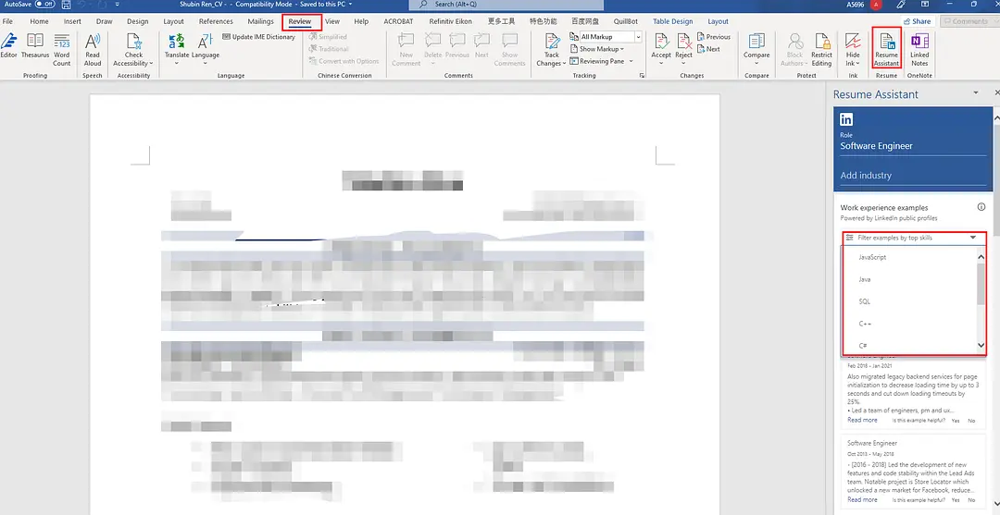
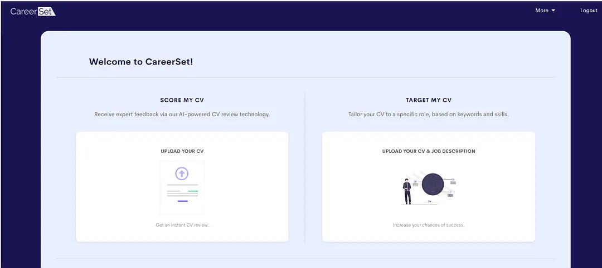
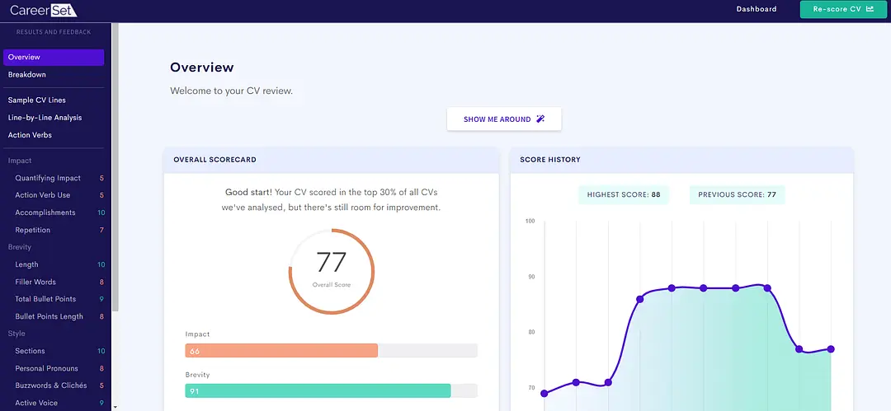
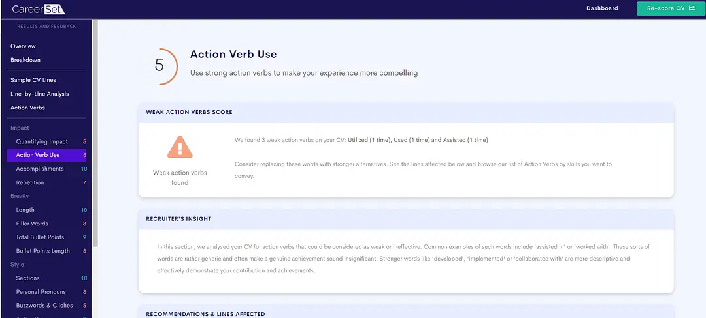
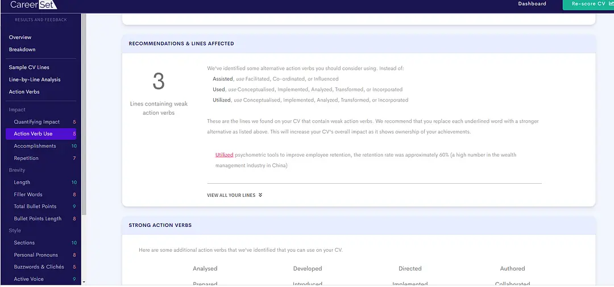
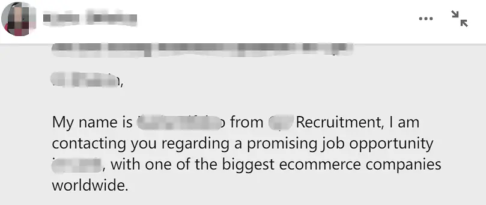
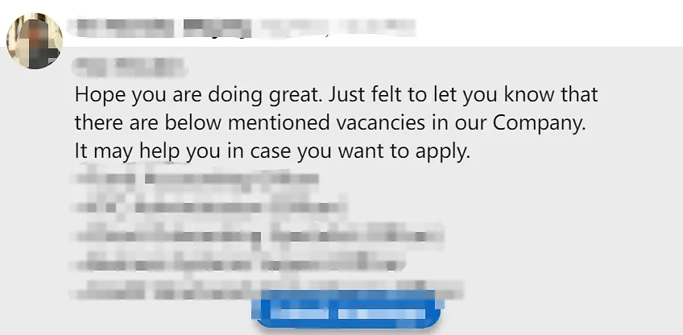

# 求职|在爱尔兰找工作攻略1：简历篇

来自：[爱岛小🐏](https://www.douban.com/people/207322593/?_i=7367757FQMtshO) 2022-01-14 21:17:53

[原帖链接](https://www.douban.com/note/823990325/?_i=2804174m1JSfBK,7373208FQMtshO)

有几个姐妹关注我，想让我分享如何在爱尔兰找工作。刚好这两天有时间，抓紧时间写出来，供大家做参考。

首先，我不是种子选手，我的室友，2月份没毕业就拿到了大厂SDE的offer,但我不是，我投递了超过200份简历，大部分是没有回应的，从最开始的两眼抓瞎到最后完全理清思路上岸，经历了一个漫长且复杂的过程，也浪费了无数次好的求职机会。我走过了招聘的所有弯路，在这个过程中也总结了足够多的经验。把这些经验写出来，希望后面找工作的姐妹们，可以避开弯路顺利拿到自己心仪的offer.

因为要写的实在是太多了，所以我会分为三个部分来更新。第一个部分是如何打造简历和和招聘软件，建立自己的人脉网。第二是如何求职，第三部分会做QA解答大家的问题。

这是求职第一篇，我会从3个方面介绍简历篇。第一是如何打造简历，第二是如何增加简历含金量，第三是如何打造求职软件，让机会来找你。

## 一，打造自己的简历

在打造简历的时候，你必须借助你所能借助的一切资源，你的同学，你认识的HR，就业辅导中心的老师，学校提供的就业辅导工具（很好用，但是大部分的人不知道），总之不要自己一个人默默埋头写简历，然后自己觉得写的不错就开始投递！这样你失败的概率会非常高。每一个岗位都非常的珍贵，只有一次可投递的机会。简历不好就别投！

在写简历的时候，需要转换思路，丢弃掉学生思维。简历是写给HR看的，不是给你自己的，所以你要站在HR的角度去思考。如果你是这个岗位的HR，你最想看到什么样的简历？你会不会通过你自己的简历？请大家不要考验一个HR的耐性，他们平均30秒钟看一份简历，不要让HR在你的简历中寻找你的优点是不是足以匹配岗位，他不会的。你必须让你的简历匹配你所投的岗位，并且所有优势一目了然。

当你转换了你的思路，站在HR的角度以后，接下来就进入到第二个步骤，确定你的求职目标，你求职的是哪一个方向？哪一个职位？这个职位的JD要求是什么，一般需要什么样的技能？你必须做到烂熟于心，尽量让自己写的所有经验贴合岗位JD，不相关的不要写.有的UU们，没有工作经验，生怕简历信息不丰富，把一堆自己能写的不能写的全部写进去了。美剧《逍遥法外》里，女主教给她的学生三招如何逍遥法外，其中有一个就是给陪审团提供大量的证据，让他们晕头转向。你想想你是不是在做同样的事情？用大量无关信息把HR埋了？还是你以为HR有那个耐性认真翻看你的简历从一堆无关信息中找岗位贴合度？

写有一个很好的方法就是借鉴。就像我们小时候写作文一样，你不知道怎么写的时候，看看别人怎么写，看得多了就有思路了。简历也是一样的，如果你不知道怎么写简历，你先去看看别人怎么写的。

比如你在写Opener的时候，你可以上Linkedln去参考别人是怎么写的,总结总结，再来写自己的Opener。Word也有一个非常好用的工具来修改简历。在你修改简历的时候，可以打开Resume Assistant,如下如所示，这样会直接链接到Linkedln的简历资料库中，你就可以借鉴同样岗位别人是怎么写的，来丰富自己的简历，你甚至还可以filter关键词条。一般学校会提供最新版本的microsoft供学生下载，如果你没有的话更新一下就应该能找到了。

当你把你的简历写出来以后，一定要修改你的简历。首先你可以找同学，把你的简历发给不同的同学，大家互相提供一些修改意见，互相修改简历。还有，请一定联系就业辅导中心的老师，让他们帮帮忙看看你的简历，提出修改意见，他们本身就是资深的HR！会针对你的求职意愿来评估你的简历，并且给出非常中肯的建议。如果你有认识的HR，也可以请他们帮忙看看你的简历是否过关。

当你反复修改，打磨你的简历以后，我相信这个时候，你已经得到了一份很不错的简历了，在你投递之前，一定要talor你的简历，不要海投不要海投不要海投！重要的事情说三遍！大家要知道，现在可是疫情期间，爱尔兰这个小国家受到的冲击还是很大的。很多企业都缩减了招聘计划！你还要跟来自各个国家的人竞争，我们还存在签证的短板，你还海投！你这与自寻死路有什么区别！

如何Talor你的简历？你要反复去看岗位的JD，将重点要求的技能标注出来。我随便举个例子，比如它要求你有communication skills，那你就要在你的简历中写出来你的强项是communication skills， 并且在你的工作经验中突出你跟客户打交道多年巴拉巴拉之类，实在不知道怎么改的linkedln filter一下这个技能，看别人怎么写的再修改。

同时，使用学校提供的工具。推荐一个超级好用的工具：careerset。可以用来修改和target简历和Cover letter. 注意，这个网站是需要钱的，但是一般跟学校都有合作，用学校的邮件登陆的话就免费。

左边上传简历，右边可以上传JD

有只上传了简历，所以只是简历的评估

随便选了一个评估维度，action verb use 5分

AI会给出修改意见

以上是我用旧的简历做的部分示例，AI会从不同维度综合给我的简历打分。我的简历只有77分，低于80分的话代表的简历有一些瑕疵需要继续修改，并给出修改意见，左边蓝色的部分是不同的维度。如图所示我的简历Action Verb Use只有5分，因为我使用了三个比较弱的动词Assisted, Used, Utilised,然后AI会给出修改意见。例如assisted 建议用facilitated, co-ordinated, or influenced替换修改。同样的还可作用到Target简历里，只需要将岗位JD复制到这里，并上传简历，AI会综合判断简历匹配度并给出一个分数和修改意见。我就不做示例了，总之很好用。

每一个学校都会有类似于这样的工具提供给大家并且都是免费的。请大家一定善用这些工具来提高自己简历的匹配度。我发现很多人其实并没有利用这些工具，我身边甚至知道这个工具的同学都寥寥无几。

## 二，丰富简历内容

第一部分我们提到，要target简历，要突出你所拥有经验的相关性。你所有的经验都要围绕你所申请的职位。但是，有的同学刚毕业从来没有工作经验，或者有很多同学转岗来自其他专业，那怎么办呢？

很简单，不断丰富自己的经验。尽自己最大的努力去丰富自己的project experience, Part-time jobs, College Projects, Assignments, Volunteering, Online training , Virtual /remote experience 这些你都可以计算在内。

以下是你可以获得internship的一些网站供大家参考，本人和室友都做了forage的一些virtual experience项目。

https://www.theforage.com/ 涵盖了各个学科，有的还是很不错的，如果项目难度大可以youtube搜索以下教程

https://www.volunteercork.ie/

https://www.i-vol.ie/advanced-search/

https://www.brightnetwork.co.uk/internship-experience-uk/

https://www.activelink.ie/

当然，你也可以通过线上学习，获得认证来增加自己的简历含金量，例如，[https://www.edx.org/](https://www.edx.org/%20) 里面有包括来自MIT 和Harvard等全球140多个领先机构的知名学府的免费在线课程。类似的网站很多，大家可以去找最适合自己的课程来学习。

https://www.udemy.com 我个人很喜欢的网站

https://www.ecollege.ie/course

https://www.coursera.org/

[https://www.futurelearn.com/](https://www.futurelearn.com/%20)

https://www.mooc-list.com/tags/europe

## 三，打造linkedln,建立自己的人脉网络，让工作机会来找你

很多同学会忽略到linkedln的重要性。linkedln除了名字学校什么信息都没留下，甚至连一张照片都没有！linkedln非常的重要UU们，很多的HR，包括中介机构，都是通过linkedln寻找候选人的，只有30%的岗位是对外招聘的，70%并不会，那他们怎么找人呢？一般就是内推和linkedln. 这个自我展示的平台，一定要用好。会给你带来很多机会。

Recruiter问我是否对该职位感兴趣

学长问是否需要内推

本人收到了好几个中介的邮件推荐岗位，也有人主动联系问是否需要内推等。被动钓鱼全部都是来自于linkedln.所以大家一定要善用linkedln. 因为Linkedln涉及个人隐私，就不给大家展示我自己的了，你看看谁做的还不错直接照搬模式就可以，然后关注你自己的母校，加一些你的同校好友，再添加一些机构recruiters，他们经常会post一些正在招聘的职位。

做一些linkedln认证徽章，比如python，excel, 等等，这样当HR搜人的时候，有徽章的会首先standout，也可以同学之间互相技能认证。这些都会给人留下深刻的印象。

linkedln展开来讲的话东西太多了，等我把这个求职篇写完了专门出一期linkedln.

简历的打造是求职过程中的第一个步骤，也是非常重要的步骤。做好这个步骤，就已经成功了50%。后面我会更新求职的第二步：投递简历的正确方法。

比如何时开始投递？秋招投递哪些公司？换工作签证前后投递公司的区别以及注意事项？爱尔兰最常用的招聘网站集合等等信息。

有问题的请留言。
