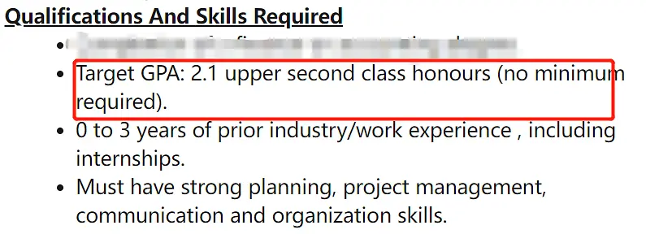
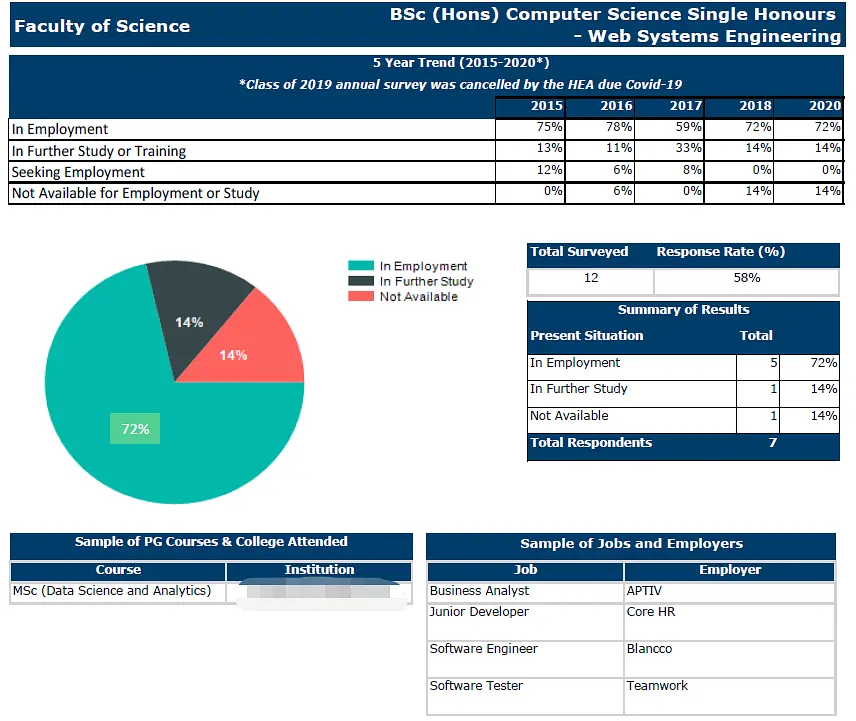

# 求职|在爱尔兰找工作攻略2：求职篇

来自: [爱岛小🐏](https://www.douban.com/people/207322593/?_i=7367757FQMtshO) 2022-01-22 07:09:16

我之前发布过在爱尔兰找工作攻略的第一篇--简历篇。地址在这里： [https://www.douban.com/note/823990325/?_i=2803535m1JSfBK,2804174m1JSfBK](https://www.douban.com/note/823990325/?_i=2803535m1JSfBK%2C2804174m1JSfBK)

现在整理第二篇：求职篇。

我分了以下5个步骤来分享：

1.  投递简历之前的准备
2.  Creative Job Seeking
3.  寻找毕业生工作机会
4.  工签前后求职方向变化
5.  求职心态

## 一，投递简历之前的准备工作

1，Career Research

首先我要恭喜你，如果你走到了投递简历的步骤，证明已经准备了一份满意的简历，那你已经成功了50%。在你正式开始投递简历之前，你需要做的是Career Research. 让你的职业之路更加清晰。怎么做Career Research. 很简单，问自己几个问题：

a.你知道你在找什么样的工作机会

b.你的性格适合你所要寻找的工作吗？

c.你知道从哪里去找工作机会吗

d.怎么样执行自己的找工作计划

e.你们专业之前的毕业生，都去了哪些公司？他们的职业是什么？

Career Research非常重要，它给你的求职之路确定方向，这是最高效的一种求职之路。如果你用正确的方法，也许很快你就会找到心仪的工作上岸，而不是投了几百封简历无一回应（这种情况在爱尔兰也并不少见），然后把自己搞得心力交瘁亚历山大。总之你前期的准备工作越多，越充分，你就可以更快的达到自己求职目的地。

2，学习成绩达到2H1

因为有一些企业在招聘的时候，会要求毕业生取得2h1的学位，也就是毕业生的平均分达到60分，这个要求并不是很高，基本上只要你认真做作业，都可以达到。

3，从学长处获得灵感

知道前辈们的就业方向，也会给自己一个很好的启发和方向。哪些公司雇佣了你们专业的毕业生？他们都从事的是哪方面的职位？了解的越多，越有有助于你做自己的职业规划。大多数爱尔兰的学校都有做Graduate Outcomes Survey,也就是毕业后6-9个月的毕业生他们的就业方向。你很容易就可以从你们学校的官网获得这些信息。

学长的另外一个作用是会给你很多有用的信息，所以找到一个愿意帮忙有爱心的学长会有很多的帮助。我身边有太多前辈帮忙找到工作的例子了。我的工作学长有帮忙，我室友的是学姐的内推得到的机会，我同学的是学长给建议的公司，作为她的重点求职方向上岸了。这样的例子一抓一大把。

## 二，Creative Job Seeking

Creative Job Seeking是一种积极主动的寻找工作的方法。相较于被动的被人选择，主动的方法会让你获得更多的机会，也更容易给雇主留下深刻的印象。

具体的方法是：

第一，研究。研究你的职业方向，JD要求，要尽量充实自己的简历，让自己符合岗位的要求。第二，研究你的雇主，求职采取的策略是：普遍撒网，重点捕捞。如果你做了一些调查，你可能就会有自己倾向的公司，或者你们专业的同学毕业后很多都去了某一家公司等，那这些公司可能就是你重点关注的对象，这些公司的岗位JD，graduate programme等信息就需要你额外的进行关注。或者你想要从事的工作，关于这类工作的internship, jobs等信息就需要你额外的关注。

第二，最大程度的发展你的人际关系网络。通过工作实习，志愿活动，工作经验，网络活动，雇主参与活动等等一些列你能参与的活动，扩大你自己的交际圈。找工作的过程中，人际关系真的太重要了。他们不经意的一个信息或者一个帮助，有可能就是你找到工作的关键！这一点我都说烂了不想再说了。你可以从学长那里得到一些关于求职的建议，或者面试的内推。我从学长那里得到过内推（虽然面试没通过），或者你的导师，行业内有经验的专业人士等等，这些人际关系网络一定会对你求职有所帮助。当然，我知道这对于很多不善于交际的学生来说有点困难，那你就在自己舒适区范围内，尽量扩大交际范围，比如找一找同专业的中国人啊等等。

第三，打造人设名片，让机会来找你。最大限度的提高自己的online profile，鼓励recruiters and employers找到你。这里主要的途径就是linkedln.关于这一点，我在简历篇已经提到过了。linkedln的作用非常之大，你不仅可以找到工作机会，你也可以获得公司/行业信息，这也是你社交资源的一个重要来源。关于linkedln这里我就不赘述了。以后如果我够勤快，会出一期如何打造linkedln.

## 三，寻找毕业生工作机会

30%的毕业生是通过graduate programme上岸的，还有大约65%-70%通过entry job上岸。当然不用我多说，你也知道毕业生项目是最好的机会。所以你要多留意graduate programme。爱尔兰的毕业生项目很早就开始了，一般从9月底陆续到2月底。有的会re-open. 所以这方便的信息你很早就要开始注意了。爱尔兰的硕士生项目只有1年，这也就意味着，你学期的开始，就要为找工作做规划了。

除了linkedln以外，很多的网站都可以找到毕业生或者entry level的工作，具体如下：

https://gradireland.com/

https://www.gradsecure.com/

[https://careersportal.ie/college/grad_recruitment.php](https://careersportal.ie/college/grad_recruitment.php%20%20)

[https://gradhub.ie/jobs/?call_type=GradStart](https://gradhub.ie/jobs/?call_type=GradStart+)

https://www.linkedin.com/jobs/graduate-jobs/

https://www.irishjobs.ie/Graduate-Recruitment-Jobs

https://ie.indeed.com/New-Graduate-jobs

加上各个学校自己的career services求职网站，基本涵盖了所有的爱尔兰主流求职网站。我比较常用的是indeed, gradireland, Linkedln.

当然，一些招聘机构也会对于大家的求职有很多的帮助，他们可以根据你的简历，给你推荐一些工作机会，或者给你一些靠谱的求职建议。我之前从recruiters那里得到过面试，也找他们帮我看看简历给意见。总之用好这个资源，你自己在求职过程中可以省很多力气。

先上两个对应届毕业生比较友好的recruiters:

https://www.nextgeneration.ie/

https://www.nextgeneration.ie/

https://www.cpl.com/ie/jobseekers (contract的合同多一些）

还有另外一个办法，你在Linkedln上加一些本专业对应的recruiters联系方式，然后发邮件将自己的简历委托给他们。他们一般也会在linkedln动态中分享很多工作机会。我之前提到过，只有30%的岗位是对外招聘的，70%可能就依靠recruiters或者hr自己捞人。这是一个很好的能发现工作机会的方式。

## 四，工签前后求职方向变化

对于想要来爱尔兰定居的小伙伴来说，工作签证太重要了。如果你在最开始就能找到愿意帮你申请工签的工作来说，那简直上上大吉。计算机专业的同学，不用太担心，只要你不是太水，英文太差，在毕业之前找到愿意赞助工签的工作还是容易的。但是其他专业的同学，可能就没那么友好了，需要做好曲线救国的准备。

为什么我要把工签放到求职这里来说？大家应该都知道，本科毕业以后，有一年的工作签证，硕士毕业，可以有2年的签证用来找工作。这几年受到疫情的影响，很多公司不太愿意赞助工签。或者你需要工作1年以后，他们才可以帮你申请签证。所以大家在找工作的时候，就需要注意，拿了工签之前和之后，你投递的方向要有所不同。

在你拿工签之前，也就是没毕业的时候，可以尽量投递那些graduate programme，或者实习的项目。等你毕业拿到签证以后，这个时候，投递的方向可以转变为entry level, 有签证要求的工作机会。不要混着投递，尤其是你很看重的机会，一定要谨慎。楼主在没毕业之前，找工作之心非常急迫，管它三七二十一各种投递。结果，有几个很好的entry level机会（需要stamp 1g我没有)，由于我毕业之前投了，因为签证原因被pass。错失了机会，现在想来真的是太鲁莽。你的重点捕捞对象，尽量做好调查，搞清楚他们是否有签证的要求，如果没有，你可以毕业之前申请，如果有，就等到拿了签证以后再申请。如果你不知道他们的要求，可以发邮件问HR，或者问一问他们公司同校的学长等等。一定要be patience.

对于那些要求stamp 4，或者要求欧盟护照的工作，直接pass，省点力气不同投递了。

另外一个很重要的点，申请工签不要等待。大部分的专业是8月30号可以拿到最终的毕业成绩，等你拿到成绩的那一刻，或者出成绩的前几天，就可以向移民局申请工签了。爱尔兰的工作效率不比国内，非常的慢。而且9月份新生开学需要向移民局申请IRP，这跟你申请工签的时间是重合的，如果你动作慢一点，可能等到你怀疑人生。我身边有人12月份拿到工作签证，也有人直到我发稿的这一刻还没拿到工作签。这都会大大影响你找工作的效率。

## 五，求职心态

本来我不打算写这个的。但是前两天跟室友讨论，发现我俩有一个共同点，就是我俩来爱尔兰之前，都蜜汁自信，觉得自己一定能找到工作并对此深信不疑。当然最终我们都按照自己的方向找到了工作。但是很多姐妹，可能会对自己不是很自信，或者因为转码等等原因，觉得自己还不够优秀，或者还没做好找工作的准备等等等等，对自己存在怀疑，并且非常焦虑。

我很能理解大家的焦虑，因为未来的一切未知，不确定性太高了，这种高不切定性再加上中国女性的自信心本来就不高，而导致深深的自我怀疑，陷入对未来的恐慌。

我想跟大家说一个理论：Planned Happenstance.有计划的偶然性，有兴趣的伙伴可以去百度一下。这个理论是斯坦福一位教授提出来的，核心思想是不要求你专注于未来制定的计划，而更多的是在计划外寻找机会。也就是follow your heart。你想一想，你的人生，有多少事情是根据你最初设定好的路线走的？有没有走着走着，忽然发现了另外一条路，然后发现，这才是你真正想要走的路？

人生真的太奇妙了，尤其是现在这个时代，不要担心不确定性。试一试在不确定性中寻找确定。你可以试一试Planned Happenstance这个方法。第一步跟随你的好奇心，让你的兴趣指引着你向前走。第二步消除你的认知障碍，将“我不能，因为...”转变成”我怎么能...”。第三步期待意外的发生，为偶然的机会做好准备。第四步采取行动，学习，发展自己的技能，保持开放的心态。也许这样会获得更好的结果也为未可知。

不要担心，相信你自己。爱尔兰相对英国，美国等这些国家已经很容易留下来了。尤其是计算机的姐妹，简直傲视所有其他专业，如果你都不能，我真的想不到还有谁可以。再加上，有这么多陌生的姐妹愿意帮助你，例如在屏幕前深更半夜还在码字的我。也许你的未来充满了未知与偶然性，但是我相信你已经做好准备了，并且你有着光明的未来再等着你。我会在爱尔兰科克这个小城准备好小酒，迎接你的到来。到时候大家喝着小酒，畅所欲言，岂不快哉。

最后贴上我室友的帖子，她是文科转码，我觉得她写的很好，感兴趣的伙伴可以去看看。

https://www.douban.com/group/topic/209301517/?_i=2805797m1JSfBK
