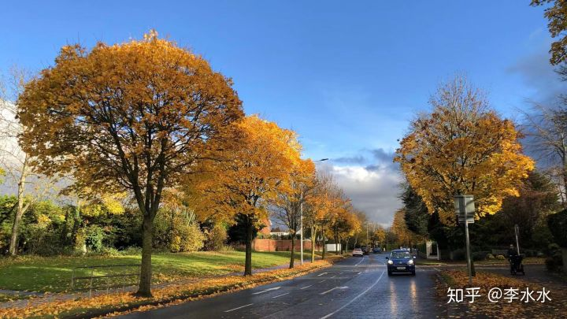
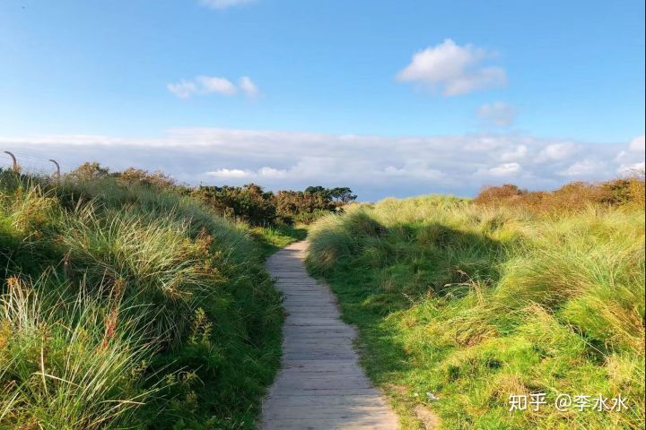
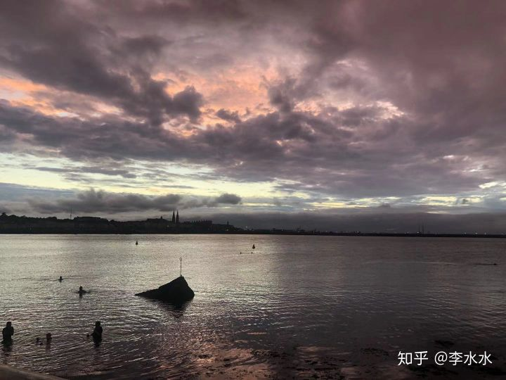
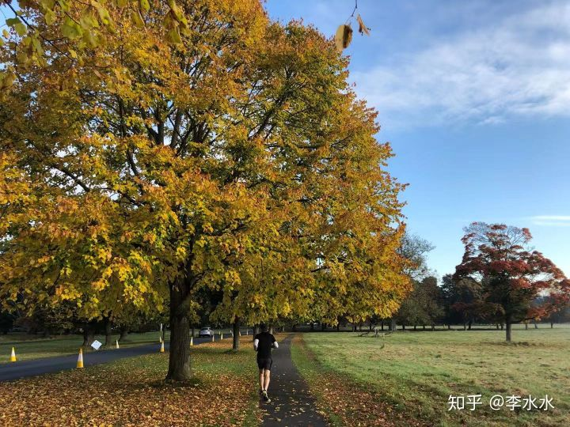
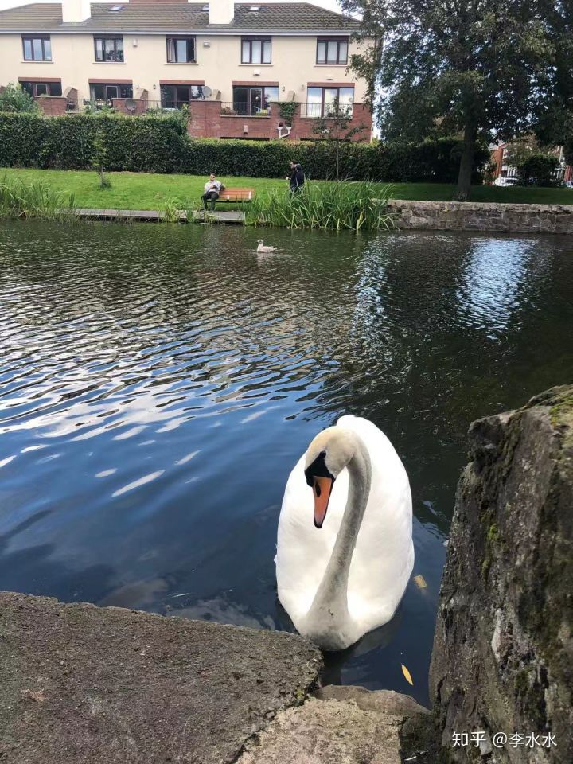

# 爱尔兰留学工作之程序媛入职1年工作体验

[原帖链接](https://zhuanlan.zhihu.com/p/296230305)

[李水水](https://www.zhihu.com/people/li-shui-shui-75)

爱尔兰留学生/计算机/转专业/已工作/已开付费咨询

**【声明】未经作者允许，本文禁止修改，商用。转载需私信作者本人。具体问题麻烦付费咨询**

这篇文章晚了2个月发，从去年（2019）9月份入职到现在，也算是渡过职场新新人的阶段啦！这期间工作上从毕业生成功“混”过试用期，到被组里同事提醒后火速走完助理升工程师，再到组里逐渐出现各种人事变动后萌发出转组计划并一步一步推进至今。

虽然才过了1年的职场生活，但是生活想法各个方面都比学生时代发生了非常大的变化。

**P.S.** 因为今年Covid-19肆虐欧洲，每个人的生活工作都发生了翻天覆地的变化。我的个人感受是出国也好找工作也好，**都要趁早上车**...很多事情赶早不赶晚，技能什么的可以入职后再磨练，但是机会真的需要好好把握。

**P.P.S.** 为了更好的帮助不了解爱尔兰程序媛工作的小伙伴们，这篇文还是会从工作环境，工作体验还有爱尔兰生活体验角度出发，希望帮到大家呀~

* * *

**【工作体验】**

去年面试的时候是毕业生岗，但是由于经理说我表现不错所以给我自动升级，所以一进组的时候算助理工程师（各位直接就是工程师进来的大神小伙伴们可以忽略这段 ）。在都柏林大部分大厂毕业生的试用期（onboarding）基本都有6个月的时间，这期间有大量的培训内容让你去学习工作内容，组里也不会立刻赶鸭子上架让你去接高级/紧急的case或者ticket，并且如果你是和其他人一起进组的话，会交到很多之后关系很好的同事们。

由于我是我们组去年招的最后一个毕业生（为了写论文跟HR要求9月才上班）所以不懂的各种问题都可以直接问比我早进去的毕业生们，大家关系非常好交谈也很轻松愉快~ 6个月试用期到的时候，经理说由于我进来就跳级了，加上平时表现还不错，所以连文档啊学习进度啊都没怎么看就爽快地给我通过了。

**！划重点**： 新人刚进去能和大家都聊的比较愉快是很重要的事情！特别是欢迎新人的酒吧聚会，第一次公司大型活动（比如万圣节party）最好都去参加。喝酒是其次，重要的是让大家觉得你是个好玩好相处的新同事，这样的话平时交流也比较轻松。我们组平时周五快下班的时候就是酒吧小聚会的提议，如果没事儿的话出去我也会和大家喝喝酒唠唠嗑，可以听到很多八卦和人事上的爆料~

之后在一次和另一个工程师的交流当中，知道马上会有一批比我早进组的毕业生要开始写升毕业生的文档了，如果跟他们一起挤到同一个月份的话，经理没有时间安排那么多面试可以会按先来后到推迟之后的人。

当时我心里警铃大作，赶紧跟那个同事谈好让当我的mentor，又跟经理约了最近的空挡面试时间，在大概过了3周半左右通过面试升了工程师，算是没跟后面的大部队挤到一起...事实证明随后发生的一些人事变动，让本来一些约好年底前面试的毕业生又被延迟了3，4个月。

**总结** —\> 人事变动是新人必须要接受并借此规划自己职业道路的一件事。组里从经理到老人到新升职的同事们在我进来的不到1年里都有离职或者转组的，这在以开始可能有点难受，不过站在对方的角度更应该祝福他们在新的职业路线上发展的更好。自己也应该未雨绸缪，借鉴别人的时间线慢慢摸索自己在未来1-2年应该怎么走。

**【工作环境】**

很庆幸自己是在Covid-19来临之前进的组，从onboarding到新人欢迎party，再到年底的万圣节party和圣诞节party是一个没落下，甚至在进组的第一周就参加了3个小型聚会...

同事们来自天南海北，巴西人数量排第一甚至超过了印度同事们，我是当时组里唯一的中国人。相处起来非常不错，日常交流也是轻松随意，拉个椅子过去就可以问问题或者讨论交流（这导致我们组有一点点吵）每周三的午餐组里请客，周五谁酒瘾来了会组织去街对面酒吧喝酒聊天。

虽然这是我第一次进入工作场合需要和上级交流，但是每两周一次和经理的一对一开会还是很容易适应的，经理第一次就开门见山的说他们的任务是帮助员工更好的工作和探索自己的职业规划。

当然工作上捅了篓子也会被问怎么回事，但是对于毕业生来讲，好好工作思考自己要在这么多业务里专注哪一点就是现阶段的要求了。况且组里几十号人，能有这样的机会和领导交流也能感觉到自己也被关注着。

**说到996这个问题，我们组朝九晚五没有加班，干不完的活儿可以直接交接给在美国的组。年假25天+，周末双休。嗯，这一点的确国外的月亮有点圆**

Covid-19之后，全公司从今年2月份开始在家办公到如今，在这期间入职的毕业生的培训都是在线上完成的，我至今没在线下见过他们之中任何一个人...还是感觉比去办公室差了点感觉。重新买了椅子（就是那种游戏主播椅）和键盘鼠标，把工位上的显示屏扛回家，我就这么开始了看不到尽头的work from home生活…

**【爱尔兰生活体验】**

现在是爱尔兰的秋季 ，也是仅次于夏天最美丽的时节。由于纬度高处于落叶乔木带，所有道路两旁不同树木的叶子铺成一片金黄橙红的景象。而且因为空气干净湿润，你会发现环境色彩的饱和度特别高，真的就是开了美食滤镜的效果！因为太喜欢秋天了所以要先说一下哈哈

【注】绝对没有开滤镜，就是苹果后置镜头直出。

【注】爱尔兰由于纬度高，所以天空显得很低感觉能碰到云朵

如果你喜欢户外运动的话，爱尔兰真的有很多户外自然活动可以让你在各种环境里（森林，大海，山坡）一边运动一边欣赏四时不同的景色。可以去森林里徒步或者爬树，去登山，去海里游泳，去骑自行车...而且！基本不会遇到人山人海的情况，作为一个小岛也不需要你长途跋涉。周末想出门走走的话，0.5-3小时以内差不多可以到达你想去的所有地方。

【注】之前和朋友去游海泳的岸边

【注】去公园里跑步也是很好的选择，早晨空气更凉爽清新

【注】千万不要招惹天鹅，被一头大鹅追的感觉绝对是噩梦....

都柏林的生活个人觉得还是挺便捷的。本地超市从大众到高档选择非常多，如果想买国内调料蔬菜零食的话，光市中心就有大大小小7，8家中国超市，而且优惠和上新的速度一点不落国内的同行们。

基本上调料蔬菜生鲜没有买不到的，各种网红零食也是经常能找到，哦对了，都柏林现在奶茶店也是遍地开花，奶茶续命完全OK 再还有微信上的蛋糕群，代购群...基本你想吃的都能找的到。

* * *

【**总结**】

在都柏林工作生活了好几年，慢慢适应了这里人少简单的生活。入职后感觉日子一下子过得快了，仿佛上一个周末的没过完多久新的周末又即将到了。生活渐渐稳定了下来之后也可以去想一些长远的规划和安排，不再被学生时代各种作业赶due催着往前跑，可以在休息日尽情做自己喜欢的事情。自己在这个绿色小岛上从学生变成打工人（笑），也很好奇不久的将来自己的人生还能发生哪些转变。

编辑于 2020-12-21 09:00

