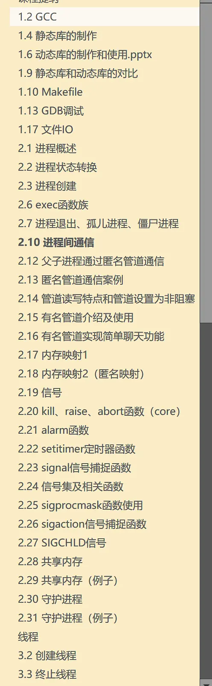
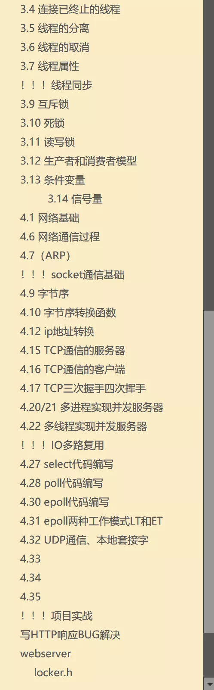
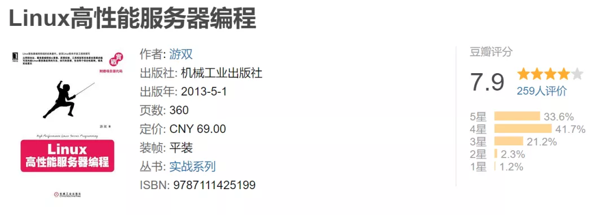
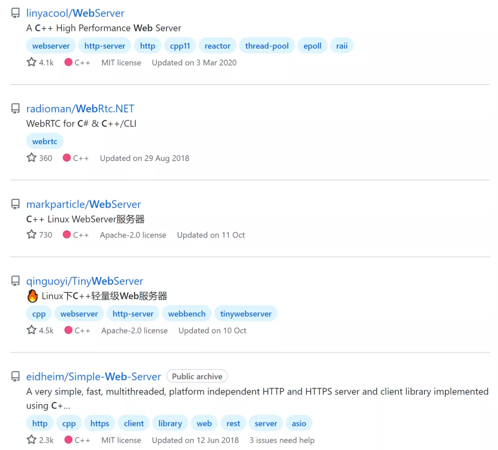
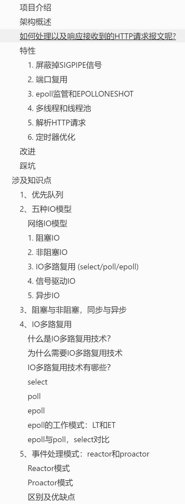
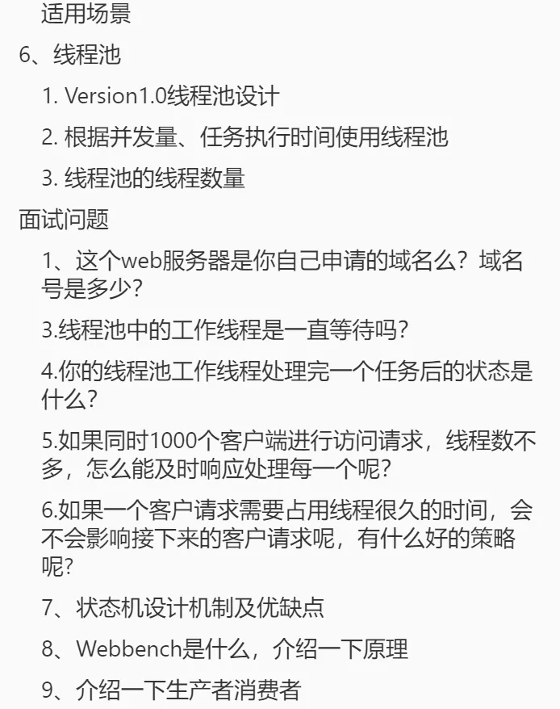

# 分享 | 非科班 | 如何丰富简历项目

来自: [骑着蜗牛追导弹](https://www.douban.com/people/170990067/) 2021-11-27 20:49:30

[原帖链接](https://www.douban.com/group/topic/254078259/?_i=7377147FQMtshO)

上次组里分享了[小白如何刷题](https://www.douban.com/group/topic/253552879/?_i=38009761f5e974b)， 受到姐妹们的鼓励，这次分享一下我秋招期间，是如何准备简历项目的，这是[公众号原文](https://mp.weixin.qq.com/s?__biz=MzkwMjE3OTY2NA==&mid=2247485534&idx=1&sn=cabe7a213647871dfdb4ce374f4671ba&chksm=c0a83661f7dfbf772f78474cb4cd0a601a5645bf89d99312a6b1c9bd7b8310c3a58217311678&token=1635915144&lang=zh_CN#rd)。下次我将在公众号分享，我整理的秋招期间，==关于这个项目面试中可能会被问到的问题，==有需要的姐妹可以先关注一下公众号。

* * *

再过一个月左右21年就要结束了，过完年，春招的春招，找实习的找实习。那么非科班小白，努力学习那么久基础知识，也[刷了不少题](http://mp.weixin.qq.com/s?__biz=MzkwMjE3OTY2NA==&mid=2247485161&idx=1&sn=7ca05d621479f82c177ae40291099f92&chksm=c0a838d6f7dfb1c06e573e08c90fd2f1e382f53a5b7c035e6beb91ed6ccec6f99faff7e00b08&scene=21#wechat_redirect)，但简历上除了个人信息，学习经历以外空空如也。。。根本凑不出来项目经历怎么办？

没有项目经历有多惨呢？我第一次投腾讯实习的时候，意向部门根本不捞我。因为我简历上没有任何相关项目经历，虽然有成绩不错，多次奖学金，数模一等奖之类的，但是项目经历那一栏只有一个根本不沾边的通信项目。

即使基础知识准备的再好，没有项目经历，甚至都过不了hr简历筛选那一关。

开始之前先说一句，这篇文章提到的内容仅适合零基础选手，纯小白只能硬着头皮上的那种。

* * *

我在这里分享一下，我自己在秋招前期准备的一个关于C++的项目，牛客的《linux高并发服务器开发》课程，这个课程最后的实战项目就是C++人手一份的多并发web服务器项目。

关于这个课程，特别需要强调的一点，我不是卖课的，并没有接任何推广，如果真是推广，我一定大喇叭宣告全世界“我有外快了”。这次只是给大家掏心窝子的分享一下当初的我是怎么一步一步准备项目的。

[关于我](https://mp.weixin.qq.com/s/IJM9eRFPDGJoRDRGF7QxAg)，当初我对linux系统编程和网络编程没有任何基础，虽然B站上也有类似的视频，但因为相关资料不是很全，也没有人可以答疑，学起来非常不方便，就斥巨资和朋友拼了这个课，不过好消息可以告诉大家，这个课程目前已经免费，这是项目地址：==https://www.nowcoder.com/courses/cover/live/504==

这是当初在学这个课程的时候，把配套的课件导入OneNote，除了跟着敲敲代码以外，还配套勾勾画画做了些笔记。

从我的笔记目录截图里面可以看到，这个课程的内容主要分为linux系统编程入门，多进程多线程开发，linux网络编程和项目真实搭建。前三个部分主要是讲解一些项目会用到的知识点，最后一部分是带着敲一遍项目。

虽然后期我听说很多人喷这个老师恰烂钱，讲的很浅。不过对于只写过一些力扣代码的小白来说，如天降甘霖。这个课程讲的还是比较细节的，包括从软件安装，远程连接，linux使用，多少都涉及一些，可以快速上手。

有两个需要注意的点：

01.不要漏过前面的知识点讲解

大家如果打算跟着做的话，不要漏过前三节的知识点讲解，一个字都不要漏，这些知识点面试的时候真的被问的非常多！非常多！

02.一边理解一边手敲

切记：看视频的时候，一定要跟着敲，时时刻刻问自己他为什么这样写？为什么这样设计？不要想着偷懒，觉得自己只需要大概看懂了，背背面经就可以。

在我字节二面的时候，就被问到这个项目了，但惊悚的是，面试官没有像别人一样只是让我只是嘴上说说，而是让我手写一下整个高并发相关的代码，也就是怎么建立新连接，怎么处理请求等等，包括epoll处理，socket一系列的API。

这些东西平时说起来已经倒背如流，但如果真的让现场写，对于不熟练的人来说，有很多小细节注意不到，甚至函数名都写不利索。

多亏看这个课程的时候，我都是一边理解一边手敲，所以当时面试的时候，也是有惊无险的写了大概。但我永远记得自己磕磕绊绊，绞尽脑汁回忆的时候，悔恨自己为什么不学的再认真一点。

有种在考场上碰见原题了，你清楚地记得自己见过这道题，也清楚地记得自己没看这道题的解析，只能拼命从那惊鸿一瞥中回忆到底是怎么做的。

* * *

单推荐项目是不够的，下面来解答几个大家比较关心的问题【项目烂大街？】【知识点讲的浅？】【怎么把它变成属于自己的项目？】

Q1：项目烂大街？

虽然我向大家推荐了这个项目，但毫不掩饰的讲：C++高并发web服务器，这种类型的项目，确实非常烂大街，真的几乎人手一份。

可能科班同学或者大佬真的看不上这个项目，觉得不如自己稍微写个小轮子也比这强。道理是这样的，但对于小白来说但凡能有个稍微像样点的课设、项目，也就不称自己零基础了，你说是吧？

项目烂大街没关系，只要里面包含面试官想让你掌握的知识点就可，比如linux，多线程，socket，git，cmake，网络编程等等。校招更看重的是你对基础知识的掌握，以及你这个人学习能力如何，其他语言java, python, go也应如是。

分享一个立竿见影的小故事：

前文提到，我第一次投腾讯实习的时候，简历直接被刷。难过之余，我痛下决心，尽快刷完了这个视频，即使还没有完全吃透，也硬着头皮写到简历上。当时刚更新完腾讯官网的简历，不到五分钟，腾讯Hr就来电话了，问我愿不愿意参加XX部门的面试?

在答应面试以后，我好奇的问了一句：“我之前投的不是XX部门吗？怎么您给捞了？”。HR说：“哦我看见你简历项目上的关键字写了会linux，网络编程，觉得和我们部门要求很契合。”

所以懂了吗？转专业的、非科班的小伙伴们懂了吗？项目烂大街没关系，学会相关技能就行。

Q2：知识点讲的浅？

这种类似于培训班的学习视频不可避免的就是浅尝辄止，知识点讲的不够深入全面。所以在看这个视频课程的时候，建议配套使用游双的《linux高性能服务器编程》。

牛客视频课程基本上就是这本书的缩减版，对于基础比较弱的同学，先来一遍牛客视频，再来看这本书就非常有感觉了。

Q3：怎么把它变成属于自己的项目？

虽然大家都说“只要看会了，那就是自己的”。这种话骗骗自己就可以了，还是要认清现实，假如真这样干了，万一秋招的时候面试官问：“这是你自己写的吗？”这时候你该说是还是不是呢，总不能说我是跟着视频写的吧。

在看完前面推荐的视频和书籍以后，有两个小建议：

01.融会贯通

尝试自己改写或者增添一些小功能，这里我抛砖引玉的说一下，比如把基于Reactor高并发模式换成Proactor，把遍历链表换成复杂度更低的小根堆，加上单例模式等等。

【善用github】上图是我在github上随意搜索了一下C++web服务器项目出来的内容，可以看到有不少人在此基础上做了改进，这些可以给你一些优化改进的思路。

在做完这些以后，如果面试官问到“这是你自己写的吗”这种问题的时候，你可以说“这个项目我是看书学习的，但是在这个基础上我觉得原本的XX设计不是很好，优化了XX内容，这样做的好处是XXX。” 任何你自己优化的部分所涉及到的知识点，都可以和面试官详细聊，只要展示了你在这个过程中的思考，他也就不会揪着项目来源了，毕竟面试的目的又不是查户口，只是通过聊天看看你有没有掌握相关技能。

02.备好腹稿

项目写了那么多，坑都挖好了，就等着面试官来问了，所以一定要提前准备好可能会被问到的内容。

就像上面说的，任何你自己优化的部分所涉及到的知识点，甚至是这个项目所涉及的八股文，都要提前准备好，否则就成了给自己埋坑。

常见的八股文比如，epoll/poll/select三姐妹，Reactor/Proactor优缺点，http等等。下图是我在秋招时期，搜索并总结的关于这个项目的相关问题的笔记，有机会的话，可以给大家整理出来。

当然前期不必考虑那么多，今天我所说的【融会贯通】【备好腹稿】也不是一气呵成的，这是一个反复理解，反复改进的过程。

千万别想着我要把这些全部搞定再去投公司，那可能会被自己的拖延症害惨，尤其是相对要求比较低的实习，越早投越简单，秋招也一样。每一次面试，才是进步最大的时候，有压力才有动力。

确实见过某位同学，其实在我们看来他已经准备的很好了，但一直不敢投，所以到10、11月份还面试。虽然最后也拿到了满意的大厂offer，但她本人那段时间真的非常难熬。尤其是你身边的小伙伴可能纷纷在八月底已经躺了，只有你一个人前途未卜，那滋味可想而知。

公众号漏网小鱼
